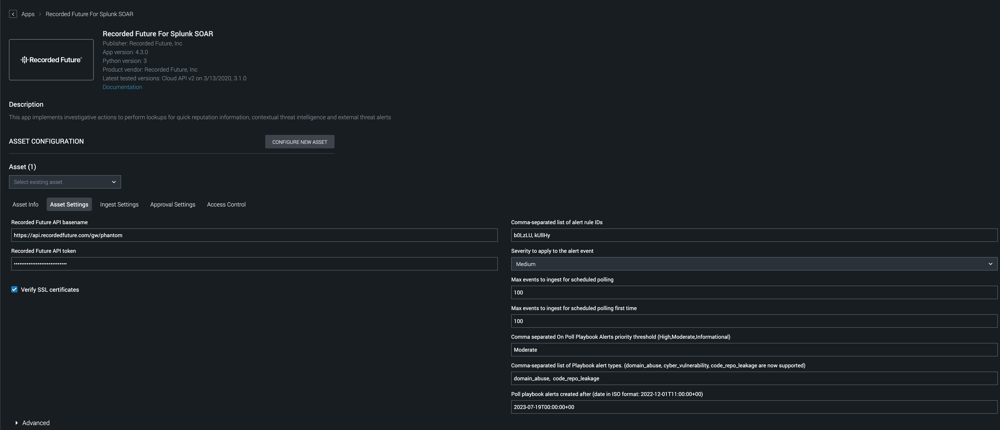
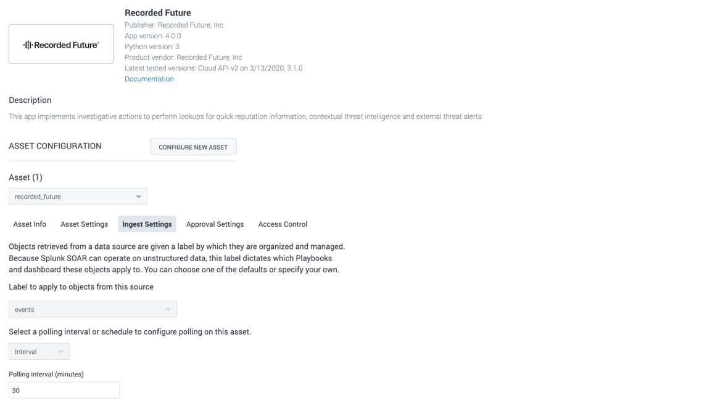

[comment]: # "Auto-generated SOAR connector documentation"
# Recorded Future For Splunk SOAR

Publisher: Recorded Future, Inc  
Connector Version: 4.4.2  
Product Vendor: Recorded Future, Inc  
Product Name: Recorded Future App for Phantom  
Product Version Supported (regex): ".\*"  
Minimum Product Version: 6.2.1  

Enhance your security posture with Recorded Future for Splunk SOAR.
Key Capabilities:
•Swift Threat Assessments: Access Recorded Future's extensive IOC data for swift and accurate assessments

[comment]: # " File: README.md"
[comment]: # ""
[comment]: # "Copyright (c) Recorded Future, Inc, 2019-2024"
[comment]: # ""
[comment]: # "This unpublished material is proprietary to Recorded Future. All"
[comment]: # "rights reserved. The methods and techniques described herein are"
[comment]: # "considered trade secrets and/or confidential. Reproduction or"
[comment]: # "distribution, in whole or in part, is forbidden except by express"
[comment]: # "written permission of Recorded Future."
[comment]: # ""
[comment]: # "Licensed under the Apache License, Version 2.0 (the 'License');"
[comment]: # "you may not use this file except in compliance with the License."
[comment]: # "You may obtain a copy of the License at"
[comment]: # ""
[comment]: # "    http://www.apache.org/licenses/LICENSE-2.0"
[comment]: # ""
[comment]: # "Unless required by applicable law or agreed to in writing, software distributed under"
[comment]: # "the License is distributed on an 'AS IS' BASIS, WITHOUT WARRANTIES OR CONDITIONS OF ANY KIND,"
[comment]: # "either express or implied. See the License for the specific language governing permissions"
[comment]: # "and limitations under the License."
[comment]: # ""
Recorded Future App for Phantom allows clients to work smarter, respond faster, and strengthen their
defenses through automation and orchestration. The Recorded Future App provides a number of actions
that enable the creation of Playbooks to do automated enrichment, correlation, threat hunting, and
alert handling.

# Ingest alerts into events

With alerting rules set up in your Recorded Future enterprise, triggered alerts can now be ingested
in Splunk SOAR as events.The ingestion configuration is set per asset under the tabs "Asset
Settings" and "Ingest Settings".

"Asset Settings" defines a list of rule IDs, what severity to apply to the new events and set the
limits for the number of events created by the ingestion.

The scheduling of the ingestion is set under "Ingest Settings"

### Configuration Variables
The below configuration variables are required for this Connector to operate.  These variables are specified when configuring a Recorded Future App for Phantom asset in SOAR.

VARIABLE | REQUIRED | TYPE | DESCRIPTION
-------- | -------- | ---- | -----------
**recordedfuture_base_url** |  required  | string | Recorded Future API basename
**recordedfuture_api_token** |  required  | password | Recorded Future API token
**recordedfuture_verify_ssl** |  optional  | boolean | Verify SSL certificates
**on_poll_alert_ruleids** |  optional  | string | Comma-separated list of alert rule IDs
**on_poll_alert_severity** |  optional  | string | Severity to apply to the alert event
**on_poll_alert_status** |  optional  | string | Comma separated list of alert statuses to poll (New, Pending, Dismissed, Resolved are now supported)
**ph1** |  optional  | ph | 
**max_count** |  optional  | numeric | Max events to ingest for scheduled polling
**ph2** |  optional  | ph | 
**first_max_count** |  optional  | numeric | Max events to ingest for scheduled polling first time
**ph3** |  optional  | ph | 
**on_poll_playbook_alert_priority** |  optional  | string | Comma separated On Poll Playbook Alerts priority threshold (High,Moderate,Informational)
**ph4** |  optional  | ph | 
**on_poll_playbook_alert_type** |  optional  | string | Comma-separated list of Playbook alert types. (domain_abuse, cyber_vulnerability, code_repo_leakage are now supported)
**ph6** |  optional  | ph | 
**on_poll_playbook_alert_status** |  optional  | string | Comma-separated list of Playbook alert statuses. (New, InProgress, Dismissed, Resolved are now supported)
**ph7** |  optional  | ph | 
**on_poll_playbook_alert_start_time** |  optional  | string | Poll playbook alerts created after (date in ISO format: 2022-12-01T11:00:00+00)

### Supported Actions  
[test connectivity](#action-test-connectivity) - Validate the asset configuration for connectivity  
[alert update](#action-alert-update) - Update status and/or notes for the alert specified with alert_id  
[alert search](#action-alert-search) - Get details on alerts configured and generated by Recorded Future by alert rule ID and time range  
[alert lookup](#action-alert-lookup) - Get details on an alert  
[alert rule search](#action-alert-rule-search) - Search for alert rule IDs by name  
[url intelligence](#action-url-intelligence) - Get threat intelligence for a URL  
[url reputation](#action-url-reputation) - Get a quick indicator of the risk associated with a URL  
[vulnerability intelligence](#action-vulnerability-intelligence) - Get threat intelligence for a vulnerability  
[vulnerability reputation](#action-vulnerability-reputation) - Get a quick indicator of the risk associated with a vulnerability  
[file intelligence](#action-file-intelligence) - Get threat intelligence for a file identified by its hash  
[file reputation](#action-file-reputation) - Get a quick indicator of the risk associated with a file identified by its hash  
[domain intelligence](#action-domain-intelligence) - Get threat intelligence for a domain  
[domain reputation](#action-domain-reputation) - Get a quick indicator of the risk associated with a domain  
[ip intelligence](#action-ip-intelligence) - Get threat intelligence for an IP address  
[list search](#action-list-search) - Find lists based on a query  
[create list](#action-create-list) - Create new list  
[list add entity](#action-list-add-entity) - Add new entity to list  
[list remove entity](#action-list-remove-entity) - Remove entity from list  
[list details](#action-list-details) - Get list details  
[list status](#action-list-status) - Get list status info  
[list entities](#action-list-entities) - Get list entities  
[ip reputation](#action-ip-reputation) - Get a quick indicator of the risk associated with an IP address  
[threat assessment](#action-threat-assessment) - Get an indicator of the risk for a collection of entities based on context  
[list contexts](#action-list-contexts) - Get a list of possible contexts to use in threat assessment  
[playbook alerts search](#action-playbook-alerts-search) - Search Playbook alerts  
[playbook alert update](#action-playbook-alert-update) - Update Playbook alert  
[playbook alert details](#action-playbook-alert-details) - Get Playbook alert details  
[entity search](#action-entity-search) - Find entities based on a query  
[links search](#action-links-search) - Search for links data  
[detection rule search](#action-detection-rule-search) - Search for detection rule  
[threat actor intelligence](#action-threat-actor-intelligence) - Get threat actor intelligence  
[threat map](#action-threat-map) - Get threat map  
[collective insights submit](#action-collective-insights-submit) - Enables contribute data, `collective insights`, into the Recorded Future Intelligence Cloud  
[on poll](#action-on-poll) - Ingest alerts from Recorded Future  

## action: 'test connectivity'
Validate the asset configuration for connectivity

Type: **test**  
Read only: **True**

#### Action Parameters
No parameters are required for this action

#### Action Output
No Output  

## action: 'alert update'
Update status and/or notes for the alert specified with alert_id

Type: **generic**  
Read only: **False**

#### Action Parameters
PARAMETER | REQUIRED | DESCRIPTION | TYPE | CONTAINS
--------- | -------- | ----------- | ---- | --------
**alert_id** |  required  | Alert ID specifying which alert to update | string |  `recordedfuture alert id` 
**alert_status** |  required  | New alert status | string | 
**alert_note** |  required  | Text to be added to the alert | string | 

#### Action Output
DATA PATH | TYPE | CONTAINS | EXAMPLE VALUES
--------- | ---- | -------- | --------------
action_result.status | string |  |   success  failed 
action_result.parameter.alert_id | string |  `recordedfuture alert id`  |  
action_result.parameter.alert_note | string |  |  
action_result.parameter.alert_status | string |  |  
action_result.data.\*.id | string |  |  
action_result.data.\*.note.author | string |  |  
action_result.data.\*.note.date | string |  |  
action_result.data.\*.note.text | string |  |  
action_result.data.\*.status | string |  |  
action_result.data.\*.statusChangeBy | string |  |  
action_result.data.\*.statusDate | string |  |  
action_result.data.\*.title | string |  |  
action_result.summary.reason | string |  |  
action_result.summary.update | string |  |  
action_result.message | string |  |  
summary.total_objects | numeric |  `recordedfuture total objects`  |   1 
summary.total_objects_successful | numeric |  `recordedfuture total objects successful`  |   1   

## action: 'alert search'
Get details on alerts configured and generated by Recorded Future by alert rule ID and time range

Type: **investigate**  
Read only: **True**

#### Action Parameters
PARAMETER | REQUIRED | DESCRIPTION | TYPE | CONTAINS
--------- | -------- | ----------- | ---- | --------
**rule_id** |  required  | Alert Rule ID to look up alert data for | string |  `recordedfuture alert rule id` 
**timeframe** |  required  | Time range for when rules were triggered | string | 

#### Action Output
DATA PATH | TYPE | CONTAINS | EXAMPLE VALUES
--------- | ---- | -------- | --------------
action_result.status | string |  |   success  failed 
action_result.parameter.rule_id | string |  `recordedfuture alert rule id`  |  
action_result.parameter.timeframe | string |  |   anytime  -24h to now 
action_result.data.\*.alerts.\*.entities.alert.\* | string |  `recordedfuture alert id`  |  
action_result.data.\*.alerts.\*.id | string |  `recordedfuture alert id`  |  
action_result.data.\*.alerts.\*.review.assignee | string |  |  
action_result.data.\*.alerts.\*.review.note | string |  |  
action_result.data.\*.alerts.\*.ai_insights | string |  |  
action_result.data.\*.alerts.\*.review.noteAuthor | string |  |  
action_result.data.\*.alerts.\*.review.noteDate | string |  |  
action_result.data.\*.alerts.\*.review.status | string |  |  
action_result.data.\*.alerts.\*.review.statusChangeBy | string |  |  
action_result.data.\*.alerts.\*.review.statusDate | string |  |  
action_result.data.\*.alerts.\*.title | string |  |  
action_result.data.\*.alerts.\*.triggered | string |  |  
action_result.data.\*.alerts.\*.type | string |  |  
action_result.data.\*.alerts.\*.url | string |  |  
action_result.data.\*.alerts.entities.city.\*.authors | string |  |  
action_result.data.\*.alerts.entities.city.\*.entity | string |  |  
action_result.data.\*.alerts.entities.city.\*.fragment | string |  |  
action_result.data.\*.alerts.entities.city.\*.source | string |  |  
action_result.data.\*.alerts.entities.city.\*.sourceUrl | string |  |  
action_result.data.\*.alerts.entities.city.\*.title | string |  |  
action_result.data.\*.alerts.entities.country.\*.authors | string |  |  
action_result.data.\*.alerts.entities.country.\*.entity | string |  |  
action_result.data.\*.alerts.entities.country.\*.fragment | string |  |  
action_result.data.\*.alerts.entities.country.\*.source | string |  |  
action_result.data.\*.alerts.entities.country.\*.sourceUrl | string |  |  
action_result.data.\*.alerts.entities.country.\*.title | string |  |  
action_result.data.\*.alerts.entities.cyberVulnerability.\*.authors | string |  |  
action_result.data.\*.alerts.entities.cyberVulnerability.\*.entity | string |  `cve`  |  
action_result.data.\*.alerts.entities.cyberVulnerability.\*.fragment | string |  |  
action_result.data.\*.alerts.entities.cyberVulnerability.\*.source | string |  |  
action_result.data.\*.alerts.entities.cyberVulnerability.\*.sourceUrl | string |  |  
action_result.data.\*.alerts.entities.cyberVulnerability.\*.title | string |  |  
action_result.data.\*.alerts.entities.domain.\*.authors | string |  |  
action_result.data.\*.alerts.entities.domain.\*.fragment | string |  |  
action_result.data.\*.alerts.entities.domain.\*.source | string |  |  
action_result.data.\*.alerts.entities.domain.\*.sourceUrl | string |  |  
action_result.data.\*.alerts.entities.domain.\*.title | string |  |  
action_result.data.\*.alerts.entities.email.\*.authors | string |  |  
action_result.data.\*.alerts.entities.email.\*.entity | string |  `email`  |  
action_result.data.\*.alerts.entities.email.\*.fragment | string |  |  
action_result.data.\*.alerts.entities.email.\*.source | string |  |  
action_result.data.\*.alerts.entities.email.\*.sourceUrl | string |  |  
action_result.data.\*.alerts.entities.email.\*.title | string |  |  
action_result.data.\*.alerts.entities.hash.\*.authors | string |  |  
action_result.data.\*.alerts.entities.hash.\*.entity | string |  `file`  |  
action_result.data.\*.alerts.entities.hash.\*.fragment | string |  |  
action_result.data.\*.alerts.entities.hash.\*.source | string |  |  
action_result.data.\*.alerts.entities.hash.\*.sourceUrl | string |  |  
action_result.data.\*.alerts.entities.hash.\*.title | string |  |  
action_result.data.\*.alerts.entities.ip.\*.authors | string |  |  
action_result.data.\*.alerts.entities.ip.\*.entity | string |  `ip`  |  
action_result.data.\*.alerts.entities.ip.\*.fragment | string |  |  
action_result.data.\*.alerts.entities.ip.\*.source | string |  |  
action_result.data.\*.alerts.entities.ip.\*.sourceUrl | string |  |  
action_result.data.\*.alerts.entities.ip.\*.title | string |  |  
action_result.data.\*.alerts.entities.malwareCategory.\*.authors | string |  |  
action_result.data.\*.alerts.entities.malwareCategory.\*.entity | string |  |  
action_result.data.\*.alerts.entities.malwareCategory.\*.entity | string |  `domain`  |  
action_result.data.\*.alerts.entities.malwareCategory.\*.fragment | string |  |  
action_result.data.\*.alerts.entities.malwareCategory.\*.source | string |  |  
action_result.data.\*.alerts.entities.malwareCategory.\*.sourceUrl | string |  |  
action_result.data.\*.alerts.entities.malwareCategory.\*.title | string |  |  
action_result.data.\*.alerts.entities.operatingSystem.\*.authors | string |  |  
action_result.data.\*.alerts.entities.operatingSystem.\*.entity | string |  |  
action_result.data.\*.alerts.entities.operatingSystem.\*.fragment | string |  |  
action_result.data.\*.alerts.entities.operatingSystem.\*.source | string |  |  
action_result.data.\*.alerts.entities.operatingSystem.\*.sourceUrl | string |  |  
action_result.data.\*.alerts.entities.operatingSystem.\*.title | string |  |  
action_result.data.\*.alerts.entities.product.\*.authors | string |  |  
action_result.data.\*.alerts.entities.product.\*.entity | string |  |  
action_result.data.\*.alerts.entities.product.\*.fragment | string |  |  
action_result.data.\*.alerts.entities.product.\*.source | string |  |  
action_result.data.\*.alerts.entities.product.\*.sourceUrl | string |  |  
action_result.data.\*.alerts.entities.product.\*.title | string |  |  
action_result.data.\*.alerts.entities.technology.\*.authors | string |  |  
action_result.data.\*.alerts.entities.technology.\*.entity | string |  |  
action_result.data.\*.alerts.entities.technology.\*.fragment | string |  |  
action_result.data.\*.alerts.entities.technology.\*.source | string |  |  
action_result.data.\*.alerts.entities.technology.\*.sourceUrl | string |  |  
action_result.data.\*.alerts.entities.technology.\*.title | string |  |  
action_result.data.\*.alerts.entities.url.\*.authors | string |  |  
action_result.data.\*.alerts.entities.url.\*.entity | string |  `url`  |  
action_result.data.\*.alerts.entities.url.\*.fragment | string |  |  
action_result.data.\*.alerts.entities.url.\*.source | string |  |  
action_result.data.\*.alerts.entities.url.\*.sourceUrl | string |  |  
action_result.data.\*.alerts.entities.url.\*.title | string |  |  
action_result.data.\*.alerts.entities.vulnerability.\*.authors | string |  |  
action_result.data.\*.alerts.entities.vulnerability.\*.entity | string |  `cve`  |  
action_result.data.\*.alerts.entities.vulnerability.\*.fragment | string |  |  
action_result.data.\*.alerts.entities.vulnerability.\*.source | string |  |  
action_result.data.\*.alerts.entities.vulnerability.\*.sourceUrl | string |  |  
action_result.data.\*.alerts.entities.vulnerability.\*.title | string |  |  
action_result.data.\*.alerts.evidence.\*.criticality | numeric |  `recordedfuture risk criticality`  |  
action_result.data.\*.alerts.evidence.\*.criticalityLabel | string |  `recordedfuture risk criticality label`  |   Unusual 
action_result.data.\*.alerts.evidence.\*.evidenceString | string |  `recordedfuture evidence string`  |  
action_result.data.\*.alerts.evidence.\*.mitigationString | string |  `recordedfuture mitigation string`  |  
action_result.data.\*.alerts.evidence.\*.rule | string |  `recordedfuture evidence rule`  |  
action_result.data.\*.alerts.evidence.\*.timestamp | string |  `recordedfuture evidence timestamp`  |  
action_result.data.\*.rule.id | string |  `recordedfuture alert rule id`  |  
action_result.data.\*.rule.name | string |  |  
action_result.data.\*.rule.url | string |  |  
action_result.summary.alerts_returned | string |  |  
action_result.summary.rule_id | string |  `recordedfuture alert rule id`  |  
action_result.summary.rule_name | string |  |  
action_result.summary.total_number_of_alerts | string |  |  
action_result.message | string |  `recordedfuture result message`  |  
summary.total_objects | numeric |  `recordedfuture total objects`  |   1 
summary.total_objects_successful | numeric |  `recordedfuture total objects successful`  |   1   

## action: 'alert lookup'
Get details on an alert

Type: **investigate**  
Read only: **True**

#### Action Parameters
PARAMETER | REQUIRED | DESCRIPTION | TYPE | CONTAINS
--------- | -------- | ----------- | ---- | --------
**alert_id** |  required  | Alert ID to use for the lookup | string |  `recordedfuture alert id` 

#### Action Output
DATA PATH | TYPE | CONTAINS | EXAMPLE VALUES
--------- | ---- | -------- | --------------
action_result.status | string |  `recordedfuture result status`  |   success  failed 
action_result.parameter.alert_id | string |  `recordedfuture alert id`  |  
action_result.data.\*.entities.alert.\* | string |  `recordedfuture alert id`  |  
action_result.data.\*.entities.city.\*.authors | string |  |  
action_result.data.\*.entities.city.\*.entity | string |  |  
action_result.data.\*.entities.city.\*.fragment | string |  |  
action_result.data.\*.entities.city.\*.source | string |  |  
action_result.data.\*.entities.city.\*.sourceUrl | string |  |  
action_result.data.\*.entities.city.\*.title | string |  |  
action_result.data.\*.entities.country.\*.authors | string |  |  
action_result.data.\*.entities.country.\*.entity | string |  |  
action_result.data.\*.entities.country.\*.fragment | string |  |  
action_result.data.\*.entities.country.\*.source | string |  |  
action_result.data.\*.entities.country.\*.sourceUrl | string |  |  
action_result.data.\*.entities.country.\*.title | string |  |  
action_result.data.\*.entities.cyberVulnerability.\*.authors | string |  |  
action_result.data.\*.entities.cyberVulnerability.\*.entity | string |  `cve`  |  
action_result.data.\*.entities.cyberVulnerability.\*.fragment | string |  |  
action_result.data.\*.entities.cyberVulnerability.\*.source | string |  |  
action_result.data.\*.entities.cyberVulnerability.\*.sourceUrl | string |  |  
action_result.data.\*.entities.cyberVulnerability.\*.title | string |  |  
action_result.data.\*.entities.domain.\*.authors | string |  |  
action_result.data.\*.entities.domain.\*.entity | string |  `domain`  |  
action_result.data.\*.entities.domain.\*.fragment | string |  |  
action_result.data.\*.entities.domain.\*.source | string |  |  
action_result.data.\*.entities.domain.\*.sourceUrl | string |  |  
action_result.data.\*.entities.domain.\*.title | string |  |  
action_result.data.\*.entities.email.\*.authors | string |  |  
action_result.data.\*.entities.email.\*.entity | string |  `email`  |  
action_result.data.\*.entities.email.\*.fragment | string |  |  
action_result.data.\*.entities.email.\*.source | string |  |  
action_result.data.\*.entities.email.\*.sourceUrl | string |  |  
action_result.data.\*.entities.email.\*.title | string |  |  
action_result.data.\*.entities.hash.\*.authors | string |  |  
action_result.data.\*.entities.hash.\*.entity | string |  `file`  |  
action_result.data.\*.entities.hash.\*.fragment | string |  |  
action_result.data.\*.entities.hash.\*.source | string |  |  
action_result.data.\*.entities.hash.\*.sourceUrl | string |  |  
action_result.data.\*.entities.hash.\*.title | string |  |  
action_result.data.\*.entities.ip.\*.authors | string |  |  
action_result.data.\*.entities.ip.\*.entity | string |  `ip`  |  
action_result.data.\*.entities.ip.\*.fragment | string |  |  
action_result.data.\*.entities.ip.\*.source | string |  |  
action_result.data.\*.entities.ip.\*.sourceUrl | string |  |  
action_result.data.\*.entities.ip.\*.title | string |  |  
action_result.data.\*.entities.malwareCategory.\*.authors | string |  |  
action_result.data.\*.entities.malwareCategory.\*.entity | string |  |  
action_result.data.\*.entities.malwareCategory.\*.fragment | string |  |  
action_result.data.\*.entities.malwareCategory.\*.source | string |  |  
action_result.data.\*.entities.malwareCategory.\*.sourceUrl | string |  |  
action_result.data.\*.entities.malwareCategory.\*.title | string |  |  
action_result.data.\*.entities.operatingSystem.\*.authors | string |  |  
action_result.data.\*.entities.operatingSystem.\*.entity | string |  |  
action_result.data.\*.entities.operatingSystem.\*.fragment | string |  |  
action_result.data.\*.entities.operatingSystem.\*.source | string |  |  
action_result.data.\*.entities.operatingSystem.\*.sourceUrl | string |  |  
action_result.data.\*.entities.operatingSystem.\*.title | string |  |  
action_result.data.\*.entities.product.\*.authors | string |  |  
action_result.data.\*.entities.product.\*.entity | string |  |  
action_result.data.\*.entities.product.\*.fragment | string |  |  
action_result.data.\*.entities.product.\*.source | string |  |  
action_result.data.\*.entities.product.\*.sourceUrl | string |  |  
action_result.data.\*.entities.product.\*.title | string |  |  
action_result.data.\*.entities.technology.\*.authors | string |  |  
action_result.data.\*.entities.technology.\*.entity | string |  |  
action_result.data.\*.entities.technology.\*.fragment | string |  |  
action_result.data.\*.entities.technology.\*.source | string |  |  
action_result.data.\*.entities.technology.\*.sourceUrl | string |  |  
action_result.data.\*.entities.technology.\*.title | string |  |  
action_result.data.\*.entities.url.\*.authors | string |  |  
action_result.data.\*.entities.url.\*.entity | string |  `url`  |  
action_result.data.\*.entities.url.\*.fragment | string |  |  
action_result.data.\*.entities.url.\*.source | string |  |  
action_result.data.\*.entities.url.\*.sourceUrl | string |  |  
action_result.data.\*.entities.url.\*.title | string |  |  
action_result.data.\*.entities.vulnerability.\*.authors | string |  |  
action_result.data.\*.entities.vulnerability.\*.entity | string |  `cve`  |  
action_result.data.\*.entities.vulnerability.\*.fragment | string |  |  
action_result.data.\*.entities.vulnerability.\*.source | string |  |  
action_result.data.\*.entities.vulnerability.\*.sourceUrl | string |  |  
action_result.data.\*.entities.vulnerability.\*.title | string |  |  
action_result.data.\*.evidence.\*.criticality | numeric |  `recordedfuture risk criticality`  |  
action_result.data.\*.evidence.\*.criticalityLabel | string |  `recordedfuture risk criticality label`  |   Unusual 
action_result.data.\*.evidence.\*.evidenceString | string |  `recordedfuture evidence string`  |  
action_result.data.\*.evidence.\*.mitigationString | string |  `recordedfuture mitigation string`  |  
action_result.data.\*.evidence.\*.rule | string |  `recordedfuture evidence rule`  |  
action_result.data.\*.evidence.\*.timestamp | string |  `recordedfuture evidence timestamp`  |  
action_result.summary.alert_title | string |  |  
action_result.summary.triggered | string |  |  
action_result.message | string |  `recordedfuture result message`  |  
action_result.summary.triggered | string |  |  
summary.total_objects | numeric |  `recordedfuture total objects`  |   1 
summary.total_objects_successful | numeric |  `recordedfuture total objects successful`  |   1   

## action: 'alert rule search'
Search for alert rule IDs by name

Type: **investigate**  
Read only: **True**

#### Action Parameters
PARAMETER | REQUIRED | DESCRIPTION | TYPE | CONTAINS
--------- | -------- | ----------- | ---- | --------
**rule_search** |  optional  | Search for alert rule name and ID | string |  `recordedfuture alert rule search` 

#### Action Output
DATA PATH | TYPE | CONTAINS | EXAMPLE VALUES
--------- | ---- | -------- | --------------
action_result.status | string |  `recordedfuture result status`  |   success  failed 
action_result.parameter.rule_search | string |  `recordedfuture alert rule search`  |  
action_result.data.\*.id | string |  `recordedfuture alert rule id`  |  
action_result.data.\*.name | string |  `recordedfuture alert rule name`  |  
action_result.summary.rule_id_list | string |  `recordedfuture alert rule id`  |  
action_result.summary.rules_returned | numeric |  `recordedfuture alerts number of rules`  |  
action_result.summary.total_number_of_rules | numeric |  `recordedfuture rules count total`  |  
action_result.message | string |  `recordedfuture result message`  |  
summary.total_objects | numeric |  `recordedfuture total objects`  |   1 
summary.total_objects_successful | numeric |  `recordedfuture total objects successful`  |   1   

## action: 'url intelligence'
Get threat intelligence for a URL

Type: **investigate**  
Read only: **True**

#### Action Parameters
PARAMETER | REQUIRED | DESCRIPTION | TYPE | CONTAINS
--------- | -------- | ----------- | ---- | --------
**url** |  required  | URL to query | string |  `url` 

#### Action Output
DATA PATH | TYPE | CONTAINS | EXAMPLE VALUES
--------- | ---- | -------- | --------------
action_result.status | string |  `recordedfuture result status`  |   success  failed 
action_result.parameter.url | string |  `url`  |  
action_result.data.\*.entity.id | string |  `recordedfuture entity id`  |  
action_result.data.\*.entity.name | string |  `url`  |  
action_result.data.\*.entity.type | string |  `recordedfuture entity type`  |  
action_result.data.\*.recordedfutureLinks.entities.domain.\*.name | string |  `domain`  |  
action_result.data.\*.recordedfutureLinks.entities.domain.\*.score | string |  `recordedfuture entity risk score`  |  
action_result.data.\*.recordedfutureLinks.entities.domain.\*.type | string |  `recordedfuture research links entity type`  |  
action_result.data.\*.recordedfutureLinks.entities.file.\*.name | string |  `file`  `hash`  `sha256`  `sha1`  `md5`  |  
action_result.data.\*.recordedfutureLinks.entities.file.\*.score | string |  `recordedfuture entity risk score`  |  
action_result.data.\*.recordedfutureLinks.entities.file.\*.type | string |  `recordedfuture research links entity type`  |  
action_result.data.\*.recordedfutureLinks.entities.ip.\*.name | string |  `ip`  `ipv6`  |  
action_result.data.\*.recordedfutureLinks.entities.ip.\*.score | string |  `recordedfuture entity risk score`  |  
action_result.data.\*.recordedfutureLinks.entities.ip.\*.type | string |  `recordedfuture research links entity type`  |  
action_result.data.\*.recordedfutureLinks.entities.other.\*.name | string |  `recordedfuture research links other entity type`  |  
action_result.data.\*.recordedfutureLinks.entities.other.\*.score | string |  `recordedfuture entity risk score`  |  
action_result.data.\*.recordedfutureLinks.entities.other.\*.type | string |  `recordedfuture research links entity type`  |  
action_result.data.\*.recordedfutureLinks.entities.url.\*.name | string |  `url`  |  
action_result.data.\*.recordedfutureLinks.entities.url.\*.score | string |  `recordedfuture entity risk score`  |  
action_result.data.\*.recordedfutureLinks.entities.url.\*.type | string |  `recordedfuture research links entity type`  |  
action_result.data.\*.recordedfutureLinks.entities.vulnerability.\*.name | string |  `cve`  `vulnerability`  |  
action_result.data.\*.recordedfutureLinks.entities.vulnerability.\*.score | string |  `recordedfuture entity risk score`  |  
action_result.data.\*.recordedfutureLinks.entities.vulnerability.\*.type | string |  `recordedfuture research links entity type`  |  
action_result.data.\*.recordedfutureLinks.start_date | string |  `recordedfuture research links start date`  |  
action_result.data.\*.recordedfutureLinks.stop_date | string |  `recordedfuture research links stop date`  |  
action_result.data.\*.risk.criticality | numeric |  `recordedfuture risk criticality`  |  
action_result.data.\*.risk.criticalityLabel | string |  `recordedfuture risk criticality label`  |   Very Malicious  Malicious  Suspicious  Unusual 
action_result.data.\*.risk.evidenceDetails.\*.criticality | numeric |  `recordedfuture risk criticality`  |  
action_result.data.\*.risk.evidenceDetails.\*.criticalityLabel | string |  `recordedfuture risk criticality label`  |   Very Malicious  Malicious  Suspicious  Unusual 
action_result.data.\*.risk.evidenceDetails.\*.evidenceString | string |  `recordedfuture risk criticality label`  |  
action_result.data.\*.risk.evidenceDetails.\*.mitigationString | string |  `recordedfuture mitigation string`  |  
action_result.data.\*.risk.evidenceDetails.\*.rule | string |  `recordedfuture evidence rule`  |  
action_result.data.\*.risk.evidenceDetails.\*.timestamp | string |  `recordedfuture evidence timestamp`  |  
action_result.data.\*.risk.riskString | string |  `recordedfuture risk string`  |  
action_result.data.\*.risk.riskSummary | string |  `recordedfuture risk summary`  |  
action_result.data.\*.risk.rules | numeric |  `recordedfuture risk rules`  |  
action_result.data.\*.risk.score | numeric |  `recordedfuture risk score`  |  
action_result.data.\*.timestamps.firstSeen | string |  `recordedfuture evidence firstseen`  |  
action_result.data.\*.timestamps.lastSeen | string |  `recordedfuture evidence lastseen`  |  
action_result.data.\*.ai_insights | string |  `recorded future AI Insights`  |   Here is some AI generated text related to this entity 
action_result.summary.criticalityLabel | string |  `recordedfuture risk criticality label`  |   Very Malicious  Malicious  Suspicious  Unusual 
action_result.summary.lastSeen | string |  `recordedfuture evidence lastseen`  |  
action_result.summary.riskSummary | string |  `recordedfuture risk summary`  |  
action_result.message | string |  `recordedfuture result message`  |  
summary.total_objects | numeric |  `recordedfuture total objects`  |   1 
summary.total_objects_successful | numeric |  `recordedfuture total objects successful`  |   1   

## action: 'url reputation'
Get a quick indicator of the risk associated with a URL

Type: **investigate**  
Read only: **True**

#### Action Parameters
PARAMETER | REQUIRED | DESCRIPTION | TYPE | CONTAINS
--------- | -------- | ----------- | ---- | --------
**url** |  required  | URL to query | string |  `url` 

#### Action Output
DATA PATH | TYPE | CONTAINS | EXAMPLE VALUES
--------- | ---- | -------- | --------------
action_result.status | string |  `recordedfuture result status`  |   success  failed 
action_result.parameter.url | string |  `url`  |  
action_result.data.\*.evidence.\*.description | string |  `recordedfuture evidence description`  |  
action_result.data.\*.evidence.\*.level | numeric |  `recordedfuture evidence level`  |  
action_result.data.\*.evidence.\*.mitigation | string |  `recordedfuture evidence mitigation`  |  
action_result.data.\*.evidence.\*.rule | string |  `recordedfuture risk rule`  |  
action_result.data.\*.evidence.\*.timestamp | string |  `recordedfuture evidence timestamp`  |  
action_result.data.\*.id | string |  `recordedfuture entity id`  |  
action_result.data.\*.maxrules | numeric |  `recordedfuture max rules`  |  
action_result.data.\*.name | string |  `url`  |  
action_result.data.\*.risklevel | numeric |  `recordedfuture risk level`  |  
action_result.data.\*.riskscore | numeric |  `recordedfuture risk score`  |  
action_result.data.\*.rulecount | numeric |  `recordedfuture rule count`  |  
action_result.data.\*.type | string |  `recordedfuture entity type`  |  
action_result.summary.risklevel | numeric |  `recordedfuture risk level`  |  
action_result.summary.riskscore | numeric |  `recordedfuture risk score`  |  
action_result.summary.type | string |  `recordedfuture entity type`  |  
action_result.message | string |  `recordedfuture result message`  |  
summary.total_objects | numeric |  `recordedfuture total objects`  |   1 
summary.total_objects_successful | numeric |  `recordedfuture total objects successful`  |   1   

## action: 'vulnerability intelligence'
Get threat intelligence for a vulnerability

Type: **investigate**  
Read only: **True**

#### Action Parameters
PARAMETER | REQUIRED | DESCRIPTION | TYPE | CONTAINS
--------- | -------- | ----------- | ---- | --------
**vulnerability** |  required  | CVE vulnerability identifier to look up | string |  `cve`  `vulnerability` 

#### Action Output
DATA PATH | TYPE | CONTAINS | EXAMPLE VALUES
--------- | ---- | -------- | --------------
action_result.status | string |  `recordedfuture result status`  |   success  failed 
action_result.parameter.vulnerability | string |  `cve`  `vulnerability`  |  
action_result.data.\*.cvss.accessComplexity | string |  `cvss access complexity`  |  
action_result.data.\*.cvss.accessVector | string |  `cvss access vector`  |  
action_result.data.\*.cvss.authentication | string |  `cvss authentication`  |  
action_result.data.\*.cvss.availability | string |  `cvss availability`  |  
action_result.data.\*.cvss.confidentiality | string |  `recordedfuture cvss confidentiality`  |  
action_result.data.\*.cvss.integrity | string |  `cvss integrity`  |  
action_result.data.\*.cvss.lastModified | string |  `cvss last modified`  |  
action_result.data.\*.cvss.published | string |  `cvss published`  |  
action_result.data.\*.cvss.score | numeric |  `cvss score`  |  
action_result.data.\*.entity.description | string |  `recordedfuture entity description`  |  
action_result.data.\*.entity.id | string |  `recordedfuture entity id`  |  
action_result.data.\*.entity.name | string |  `cve`  `vulnerability`  |  
action_result.data.\*.entity.type | string |  `recordedfuture entity type`  |  
action_result.data.\*.intelCard | string |  `recordedfuture intelligence card url`  |  
action_result.data.\*.ai_insights | string |  |  
action_result.data.\*.nvdDescription | string |  `nvd description`  |  
action_result.data.\*.recordedfutureLinks.entities.domain.\*.name | string |  `domain`  |  
action_result.data.\*.recordedfutureLinks.entities.domain.\*.score | string |  `recordedfuture entity risk score`  |  
action_result.data.\*.recordedfutureLinks.entities.domain.\*.type | string |  `recordedfuture research links entity type`  |  
action_result.data.\*.recordedfutureLinks.entities.file.\*.name | string |  `file`  `hash`  `sha256`  `sha1`  `md5`  |  
action_result.data.\*.recordedfutureLinks.entities.file.\*.score | string |  `recordedfuture entity risk score`  |  
action_result.data.\*.recordedfutureLinks.entities.file.\*.type | string |  `recordedfuture research links entity type`  |  
action_result.data.\*.recordedfutureLinks.entities.ip.\*.name | string |  `ip`  `ipv6`  |  
action_result.data.\*.recordedfutureLinks.entities.ip.\*.score | string |  `recordedfuture entity risk score`  |  
action_result.data.\*.recordedfutureLinks.entities.ip.\*.type | string |  `recordedfuture research links entity type`  |  
action_result.data.\*.recordedfutureLinks.entities.other.\*.name | string |  `recordedfuture research links other entity type`  |  
action_result.data.\*.recordedfutureLinks.entities.other.\*.score | string |  `recordedfuture entity risk score`  |  
action_result.data.\*.recordedfutureLinks.entities.other.\*.type | string |  `recordedfuture research links entity type`  |  
action_result.data.\*.recordedfutureLinks.entities.url.\*.name | string |  `url`  |  
action_result.data.\*.recordedfutureLinks.entities.url.\*.score | string |  `recordedfuture entity risk score`  |  
action_result.data.\*.recordedfutureLinks.entities.url.\*.type | string |  `recordedfuture research links entity type`  |  
action_result.data.\*.recordedfutureLinks.entities.vulnerability.\*.name | string |  `cve`  `vulnerability`  |  
action_result.data.\*.recordedfutureLinks.entities.vulnerability.\*.score | string |  `recordedfuture entity risk score`  |  
action_result.data.\*.recordedfutureLinks.entities.vulnerability.\*.type | string |  `recordedfuture research links entity type`  |  
action_result.data.\*.recordedfutureLinks.start_date | string |  `recordedfuture research links start date`  |  
action_result.data.\*.recordedfutureLinks.stop_date | string |  `recordedfuture research links stop date`  |  
action_result.data.\*.relatedEntities.\*.entities.\*.count | numeric |  `recordedfuture related entities count`  |  
action_result.data.\*.relatedEntities.\*.entities.\*.entity.description | string |  `recordedfuture entity description`  |  
action_result.data.\*.relatedEntities.\*.entities.\*.entity.id | string |  `recordedfuture entity id`  |  
action_result.data.\*.relatedEntities.\*.entities.\*.entity.name | string |  `recordedfuture entity name`  |  
action_result.data.\*.relatedEntities.\*.entities.\*.entity.type | string |  `recordedfuture entity type`  |  
action_result.data.\*.relatedEntities.\*.type | string |  `recordedfuture related entity type`  |  
action_result.data.\*.risk.criticality | numeric |  `recordedfuture risk criticality`  |  
action_result.data.\*.risk.criticalityLabel | string |  `recordedfuture risk criticality label`  |   Very Critical 
action_result.data.\*.risk.evidenceDetails.\*.criticality | numeric |  `recordedfuture risk criticality`  |  
action_result.data.\*.risk.evidenceDetails.\*.criticalityLabel | string |  `recordedfuture risk criticality label`  |  
action_result.data.\*.risk.evidenceDetails.\*.evidenceString | string |  `recordedfuture evidence string`  |  
action_result.data.\*.risk.evidenceDetails.\*.mitigationString | string |  `recordedfuture mitigation string`  |  
action_result.data.\*.risk.evidenceDetails.\*.rule | string |  `recordedfuture evidence rule`  |  
action_result.data.\*.risk.evidenceDetails.\*.timestamp | string |  `recordedfuture evidence timestamp`  |  
action_result.data.\*.risk.riskString | string |  `recordedfuture risk string`  |  
action_result.data.\*.risk.riskSummary | string |  `recordedfuture risk summary`  |  
action_result.data.\*.risk.rules | numeric |  `recordedfuture risk rules`  |  
action_result.data.\*.risk.score | numeric |  `recordedfuture risk score`  |  
action_result.data.\*.timestamps.firstSeen | string |  `recordedfuture evidence firstseen`  |  
action_result.data.\*.timestamps.lastSeen | string |  `recordedfuture evidence lastseen`  |  
action_result.data.\*.ai_insights | string |  `recorded future AI Insights`  |   Here is some AI generated text related to this entity 
action_result.summary.criticalityLabel | string |  `recordedfuture risk criticality label`  |  
action_result.summary.lastSeen | string |  `recordedfuture evidence lastseen`  |  
action_result.summary.riskSummary | string |  `recordedfuture risk summary`  |  
action_result.message | string |  `recordedfuture result message`  |  
summary.total_objects | numeric |  `recordedfuture total objects`  |   1 
summary.total_objects_successful | numeric |  `recordedfuture total objects successful`  |   1   

## action: 'vulnerability reputation'
Get a quick indicator of the risk associated with a vulnerability

Type: **investigate**  
Read only: **True**

#### Action Parameters
PARAMETER | REQUIRED | DESCRIPTION | TYPE | CONTAINS
--------- | -------- | ----------- | ---- | --------
**vulnerability** |  required  | CVE vulnerability identifier to look up | string |  `cve`  `vulnerability` 

#### Action Output
DATA PATH | TYPE | CONTAINS | EXAMPLE VALUES
--------- | ---- | -------- | --------------
action_result.status | string |  `recordedfuture result status`  |   success  failed 
action_result.parameter.vulnerability | string |  `cve`  `vulnerability`  |  
action_result.data.\*.description | string |  `recordedfuture evidence description`  |  
action_result.data.\*.evidence.\*.description | string |  `recordedfuture evidence description`  |  
action_result.data.\*.evidence.\*.level | numeric |  `recordedfuture evidence level`  |  
action_result.data.\*.evidence.\*.mitigation | string |  `recordedfuture evidence mitigation`  |  
action_result.data.\*.evidence.\*.rule | string |  `recordedfuture risk rule`  |  
action_result.data.\*.evidence.\*.ruleid | string |  `recordedfuture risk rule id`  |  
action_result.data.\*.evidence.\*.timestamp | string |  `recordedfuture evidence timestamp`  |  
action_result.data.\*.id | string |  `recordedfuture entity id`  |  
action_result.data.\*.maxrules | numeric |  `recordedfuture max rules`  |  
action_result.data.\*.name | string |  `cve`  `vulnerability`  |  
action_result.data.\*.risklevel | numeric |  `recordedfuture risk level`  |  
action_result.data.\*.riskscore | numeric |  `recordedfuture risk score`  |  
action_result.data.\*.rulecount | numeric |  `recordedfuture rule count`  |  
action_result.data.\*.type | string |  `recordedfuture entity type`  |   CyberVulnerability 
action_result.summary.risklevel | numeric |  `recordedfuture risk level`  |  
action_result.summary.riskscore | numeric |  `recordedfuture risk score`  |  
action_result.summary.type | string |  `recordedfuture entity type`  |   CyberVulnerability 
action_result.message | string |  `recordedfuture result message`  |  
summary.total_objects | numeric |  `recordedfuture total objects`  |   1 
summary.total_objects_successful | numeric |  `recordedfuture total objects successful`  |   1   

## action: 'file intelligence'
Get threat intelligence for a file identified by its hash

Type: **investigate**  
Read only: **True**

#### Action Parameters
PARAMETER | REQUIRED | DESCRIPTION | TYPE | CONTAINS
--------- | -------- | ----------- | ---- | --------
**hash** |  required  | File hash to query | string |  `file`  `hash`  `sha256`  `sha1`  `md5` 

#### Action Output
DATA PATH | TYPE | CONTAINS | EXAMPLE VALUES
--------- | ---- | -------- | --------------
action_result.status | string |  `recordedfuture result status`  |   success  failed 
action_result.parameter.hash | string |  `file`  `hash`  `sha256`  `sha1`  `md5`  |  
action_result.data.\*.entity.id | string |  `recordedfuture entity id`  |  
action_result.data.\*.entity.name | string |  `file`  `hash`  `sha256`  `sha1`  `md5`  |  
action_result.data.\*.entity.type | string |  `recordedfuture entity type`  |   Hash 
action_result.data.\*.hashAlgorithm | string |  `recordedfuture hash algorithm`  |   MD5 
action_result.data.\*.intelCard | string |  `recordedfuture intelligence card url`  |  
action_result.data.\*.ai_insights | string |  |  
action_result.data.\*.recordedfutureLinks.entities.domain.\*.name | string |  `domain`  |  
action_result.data.\*.recordedfutureLinks.entities.domain.\*.score | string |  `recordedfuture entity risk score`  |  
action_result.data.\*.recordedfutureLinks.entities.domain.\*.type | string |  `recordedfuture research links entity type`  |  
action_result.data.\*.recordedfutureLinks.entities.file.\*.name | string |  `file`  `hash`  `sha256`  `sha1`  `md5`  |  
action_result.data.\*.recordedfutureLinks.entities.file.\*.score | string |  `recordedfuture entity risk score`  |  
action_result.data.\*.recordedfutureLinks.entities.file.\*.type | string |  `recordedfuture research links entity type`  |  
action_result.data.\*.recordedfutureLinks.entities.ip.\*.name | string |  `ip`  `ipv6`  |  
action_result.data.\*.recordedfutureLinks.entities.ip.\*.score | string |  `recordedfuture entity risk score`  |  
action_result.data.\*.recordedfutureLinks.entities.ip.\*.type | string |  `recordedfuture research links entity type`  |  
action_result.data.\*.recordedfutureLinks.entities.other.\*.name | string |  `recordedfuture research links other entity type`  |  
action_result.data.\*.recordedfutureLinks.entities.other.\*.score | string |  `recordedfuture entity risk score`  |  
action_result.data.\*.recordedfutureLinks.entities.other.\*.type | string |  `recordedfuture research links entity type`  |  
action_result.data.\*.recordedfutureLinks.entities.url.\*.name | string |  `url`  |  
action_result.data.\*.recordedfutureLinks.entities.url.\*.score | string |  `recordedfuture entity risk score`  |  
action_result.data.\*.recordedfutureLinks.entities.url.\*.type | string |  `recordedfuture research links entity type`  |  
action_result.data.\*.recordedfutureLinks.entities.vulnerability.\*.name | string |  `cve`  `vulnerability`  |  
action_result.data.\*.recordedfutureLinks.entities.vulnerability.\*.score | string |  `recordedfuture entity risk score`  |  
action_result.data.\*.recordedfutureLinks.entities.vulnerability.\*.type | string |  `recordedfuture research links entity type`  |  
action_result.data.\*.recordedfutureLinks.start_date | string |  `recordedfuture research links start date`  |  
action_result.data.\*.recordedfutureLinks.stop_date | string |  `recordedfuture research links stop date`  |  
action_result.data.\*.relatedEntities.\*.entities.\*.count | numeric |  `recordedfuture related entities count`  |  
action_result.data.\*.relatedEntities.\*.entities.\*.entity.id | string |  `recordedfuture entity id`  |  
action_result.data.\*.relatedEntities.\*.entities.\*.entity.name | string |  `recordedfuture entity name`  |  
action_result.data.\*.relatedEntities.\*.entities.\*.entity.type | string |  `recordedfuture entity type`  |  
action_result.data.\*.relatedEntities.\*.type | string |  `recordedfuture related entity type`  |  
action_result.data.\*.risk.criticality | numeric |  `recordedfuture risk criticality`  |  
action_result.data.\*.risk.criticalityLabel | string |  `recordedfuture risk criticality label`  |   Very Malicious 
action_result.data.\*.risk.evidenceDetails.\*.criticality | numeric |  `recordedfuture risk criticality`  |  
action_result.data.\*.risk.evidenceDetails.\*.criticalityLabel | string |  `recordedfuture risk criticality label`  |   Unusual 
action_result.data.\*.risk.evidenceDetails.\*.evidenceString | string |  `recordedfuture evidence string`  |  
action_result.data.\*.risk.evidenceDetails.\*.mitigationString | string |  `recordedfuture mitigation string`  |  
action_result.data.\*.risk.evidenceDetails.\*.rule | string |  `recordedfuture evidence rule`  |  
action_result.data.\*.risk.evidenceDetails.\*.timestamp | string |  `recordedfuture evidence timestamp`  |  
action_result.data.\*.risk.riskString | string |  `recordedfuture risk string`  |  
action_result.data.\*.risk.riskSummary | string |  `recordedfuture risk summary`  |  
action_result.data.\*.risk.rules | numeric |  `recordedfuture risk rules`  |  
action_result.data.\*.risk.score | numeric |  `recordedfuture risk score`  |  
action_result.data.\*.timestamps.firstSeen | string |  `recordedfuture evidence firstseen`  |  
action_result.data.\*.timestamps.lastSeen | string |  `recordedfuture evidence lastseen`  |  
action_result.data.\*.ai_insights | string |  `recorded future AI Insights`  |   Here is some AI generated text related to this entity 
action_result.summary.criticalityLabel | string |  `recordedfuture risk criticality label`  |   Malicious 
action_result.summary.lastSeen | string |  `recordedfuture evidence lastseen`  |  
action_result.summary.riskSummary | string |  `recordedfuture risk summary`  |  
action_result.message | string |  `recordedfuture result message`  |  
summary.total_objects | numeric |  `recordedfuture total objects`  |   1 
summary.total_objects_successful | numeric |  `recordedfuture total objects successful`  |   1   

## action: 'file reputation'
Get a quick indicator of the risk associated with a file identified by its hash

Type: **investigate**  
Read only: **True**

#### Action Parameters
PARAMETER | REQUIRED | DESCRIPTION | TYPE | CONTAINS
--------- | -------- | ----------- | ---- | --------
**hash** |  required  | File hash to query | string |  `file`  `hash`  `sha256`  `sha1`  `md5` 

#### Action Output
DATA PATH | TYPE | CONTAINS | EXAMPLE VALUES
--------- | ---- | -------- | --------------
action_result.status | string |  `recordedfuture result status`  |   success  failed 
action_result.parameter.hash | string |  `file`  `hash`  `sha256`  `sha1`  `md5`  |  
action_result.data.\*.evidence.\*.description | string |  `recordedfuture evidence description`  |  
action_result.data.\*.evidence.\*.level | numeric |  `recordedfuture risk rule level`  |   1  2  3  4  5 
action_result.data.\*.evidence.\*.mitigation | string |  `recordedfuture evidence mitigation`  |  
action_result.data.\*.evidence.\*.rule | string |  `recorded future risk rule`  |  
action_result.data.\*.evidence.\*.timestamp | string |  `recordedfuture evidence timestamp`  |  
action_result.data.\*.id | string |  `recordedfuture entity id`  |  
action_result.data.\*.maxrules | numeric |  `recordedfuture max rules`  |  
action_result.data.\*.name | string |  `file`  `hash`  `sha1`  `sha256`  `md5`  |  
action_result.data.\*.risklevel | numeric |  `recordedfuture risk level`  |  
action_result.data.\*.riskscore | numeric |  `recordedfuture risk score`  |  
action_result.data.\*.rulecount | numeric |  `recordedfuture rule count`  |  
action_result.data.\*.type | string |  `recordedfuture entity type`  |   Hash 
action_result.summary.risklevel | numeric |  `recordedfuture risk level`  |  
action_result.summary.riskscore | numeric |  `recordedfuture risk score`  |  
action_result.summary.type | string |  `recordedfuture entity type`  |   Hash 
action_result.message | string |  `action result message`  |  
summary.total_objects | numeric |  `recordedfuture total objects`  |   1 
summary.total_objects_successful | numeric |  `recordedfuture total objects successful`  |   1   

## action: 'domain intelligence'
Get threat intelligence for a domain

Type: **investigate**  
Read only: **True**

#### Action Parameters
PARAMETER | REQUIRED | DESCRIPTION | TYPE | CONTAINS
--------- | -------- | ----------- | ---- | --------
**domain** |  required  | Domain to query | string |  `domain` 

#### Action Output
DATA PATH | TYPE | CONTAINS | EXAMPLE VALUES
--------- | ---- | -------- | --------------
action_result.status | string |  `recordedfuture result status`  |   success  failed 
action_result.parameter.domain | string |  `domain`  |  
action_result.data.\*.entity.id | string |  `recordedfuture entity id`  |  
action_result.data.\*.entity.name | string |  `domain`  |  
action_result.data.\*.entity.type | string |  `recordedfuture entity type`  |  
action_result.data.\*.intelCard | string |  `recordedfuture intelligence card url`  |  
action_result.data.\*.ai_insights | string |  |  
action_result.data.\*.recordedfutureLinks.entities.domain.\*.name | string |  `domain`  |  
action_result.data.\*.recordedfutureLinks.entities.domain.\*.score | string |  `recordedfuture entity risk score`  |  
action_result.data.\*.recordedfutureLinks.entities.domain.\*.type | string |  `recordedfuture research links entity type`  |  
action_result.data.\*.recordedfutureLinks.entities.file.\*.name | string |  `file`  `hash`  `sha256`  `sha1`  `md5`  |  
action_result.data.\*.recordedfutureLinks.entities.file.\*.score | string |  `recordedfuture entity risk score`  |  
action_result.data.\*.recordedfutureLinks.entities.file.\*.type | string |  `recordedfuture research links entity type`  |  
action_result.data.\*.recordedfutureLinks.entities.ip.\*.name | string |  `ip`  `ipv6`  |  
action_result.data.\*.recordedfutureLinks.entities.ip.\*.score | string |  `recordedfuture entity risk score`  |  
action_result.data.\*.recordedfutureLinks.entities.ip.\*.type | string |  `recordedfuture research links entity type`  |  
action_result.data.\*.recordedfutureLinks.entities.other.\*.name | string |  `recordedfuture research links other entity type`  |  
action_result.data.\*.recordedfutureLinks.entities.other.\*.score | string |  `recordedfuture entity risk score`  |  
action_result.data.\*.recordedfutureLinks.entities.other.\*.type | string |  `recordedfuture research links entity type`  |  
action_result.data.\*.recordedfutureLinks.entities.url.\*.name | string |  `url`  |  
action_result.data.\*.recordedfutureLinks.entities.url.\*.score | string |  `recordedfuture entity risk score`  |  
action_result.data.\*.recordedfutureLinks.entities.url.\*.type | string |  `recordedfuture research links entity type`  |  
action_result.data.\*.recordedfutureLinks.entities.vulnerability.\*.name | string |  `cve`  `vulnerability`  |  
action_result.data.\*.recordedfutureLinks.entities.vulnerability.\*.score | string |  `recordedfuture entity risk score`  |  
action_result.data.\*.recordedfutureLinks.entities.vulnerability.\*.type | string |  `recordedfuture research links entity type`  |  
action_result.data.\*.recordedfutureLinks.start_date | string |  `recordedfuture research links start date`  |  
action_result.data.\*.recordedfutureLinks.stop_date | string |  `recordedfuture research links stop date`  |  
action_result.data.\*.relatedEntities.\*.entities.\*.count | numeric |  `recordedfuture related entities count`  |  
action_result.data.\*.relatedEntities.\*.entities.\*.entity.id | string |  `recordedfuture entity id`  |  
action_result.data.\*.relatedEntities.\*.entities.\*.entity.name | string |  `recordedfuture entity name`  |  
action_result.data.\*.relatedEntities.\*.entities.\*.entity.type | string |  `recordedfuture entity type`  |   Hash 
action_result.data.\*.relatedEntities.\*.type | string |  `recordedfuture related entity type`  |  
action_result.data.\*.risk.criticality | numeric |  `recordedfuture risk criticality`  |  
action_result.data.\*.risk.criticalityLabel | string |  `recordedfuture risk criticality label`  |   Very Malicious 
action_result.data.\*.risk.evidenceDetails.\*.criticality | numeric |  `recordedfuture risk criticality`  |  
action_result.data.\*.risk.evidenceDetails.\*.criticalityLabel | string |  `recordedfuture risk criticality label`  |   Unusual 
action_result.data.\*.risk.evidenceDetails.\*.evidenceString | string |  `recordedfuture evidence string`  |  
action_result.data.\*.risk.evidenceDetails.\*.mitigationString | string |  `recordedfuture mitigation string`  |  
action_result.data.\*.risk.evidenceDetails.\*.rule | string |  `recordedfuture evidence rule`  |  
action_result.data.\*.risk.evidenceDetails.\*.timestamp | string |  `recordedfuture evidence timestamp`  |  
action_result.data.\*.risk.riskString | string |  `recordedfuture risk string`  |  
action_result.data.\*.risk.riskSummary | string |  `recordedfuture risk summary`  |  
action_result.data.\*.risk.rules | numeric |  `recordedfuture risk rules`  |  
action_result.data.\*.risk.score | numeric |  `recordedfuture risk score`  |  
action_result.data.\*.threatLists.\*.description | string |  `recordedfuture threatlist description`  |  
action_result.data.\*.threatLists.\*.id | string |  `recordedfuture threatlist id`  |  
action_result.data.\*.threatLists.\*.name | string |  `recordedfuture threatlist name`  |  
action_result.data.\*.threatLists.\*.type | string |  `recordedfuture threatlist type`  |  
action_result.data.\*.timestamps.firstSeen | string |  `recordedfuture evidence firstseen`  |  
action_result.data.\*.timestamps.lastSeen | string |  `recordedfuture evidence lastseen`  |  
action_result.data.\*.ai_insights | string |  `recorded future AI Insights`  |   Here is some AI generated text related to this entity 
action_result.summary.criticalityLabel | string |  `recordedfuture risk criticality label`  |   Very Malicious 
action_result.summary.lastSeen | string |  `recordedfuture evidence lastseen`  |  
action_result.summary.riskSummary | string |  `recordedfuture risk summary`  |  
action_result.message | string |  `recordedfuture result message`  |  
summary.total_objects | numeric |  `recordedfuture total objects`  |   1 
summary.total_objects_successful | numeric |  `recordedfuture total objects successful`  |   1   

## action: 'domain reputation'
Get a quick indicator of the risk associated with a domain

Type: **investigate**  
Read only: **True**

#### Action Parameters
PARAMETER | REQUIRED | DESCRIPTION | TYPE | CONTAINS
--------- | -------- | ----------- | ---- | --------
**domain** |  required  | Domain to query | string |  `domain` 

#### Action Output
DATA PATH | TYPE | CONTAINS | EXAMPLE VALUES
--------- | ---- | -------- | --------------
action_result.status | string |  `recordedfuture result status`  |   success  failed 
action_result.parameter.domain | string |  `domain`  |  
action_result.data.\*.evidence.\*.description | string |  `recordedfuture evidence description`  |  
action_result.data.\*.evidence.\*.level | numeric |  `recordedfuture evidence level`  |  
action_result.data.\*.evidence.\*.mitigation | string |  `recordedfuture evidence mitigation`  |  
action_result.data.\*.evidence.\*.rule | string |  `recordedfuture risk rule`  |  
action_result.data.\*.evidence.\*.ruleid | string |  `recordedfuture risk rule id`  |  
action_result.data.\*.evidence.\*.timestamp | string |  `recordedfuture evidence timestamp`  |  
action_result.data.\*.id | string |  `recordedfuture entity id`  |  
action_result.data.\*.maxrules | numeric |  `recordedfuture max rules`  |  
action_result.data.\*.name | string |  `domain`  |  
action_result.data.\*.risklevel | numeric |  `recordedfuture risk level`  |  
action_result.data.\*.riskscore | numeric |  `recordedfuture risk score`  |  
action_result.data.\*.rulecount | numeric |  `recordedfuture rule count`  |  
action_result.data.\*.type | string |  `recordedfuture entity type`  |   InternetDomainName 
action_result.summary.risklevel | numeric |  `recordedfuture risk level`  |  
action_result.summary.riskscore | numeric |  `recordedfuture risk score`  |  
action_result.summary.type | string |  `recordedfuture summary type`  |   InternetDomainName 
action_result.message | string |  `recordedfuture result message`  |  
summary.total_objects | numeric |  `recordedfuture total objects`  |   1 
summary.total_objects_successful | numeric |  `recordedfuture total objects successful`  |   1   

## action: 'ip intelligence'
Get threat intelligence for an IP address

Type: **investigate**  
Read only: **True**

#### Action Parameters
PARAMETER | REQUIRED | DESCRIPTION | TYPE | CONTAINS
--------- | -------- | ----------- | ---- | --------
**ip** |  required  | IP to query | string |  `ip`  `ipv6` 

#### Action Output
DATA PATH | TYPE | CONTAINS | EXAMPLE VALUES
--------- | ---- | -------- | --------------
action_result.status | string |  `recordedfuture result status`  |   success  failed 
action_result.parameter.ip | string |  `ip`  `ipv6`  |  
action_result.data.\*.entity.id | string |  `recordedfuture entity id`  |  
action_result.data.\*.entity.name | string |  `ip`  `ipv6`  |  
action_result.data.\*.entity.type | string |  `recordedfuture entity type`  |  
action_result.data.\*.intelCard | string |  `recordedfuture intelligence card url`  |  
action_result.data.\*.ai_insights | string |  |  
action_result.data.\*.location.asn | string |  `recordedfuture location asn`  |  
action_result.data.\*.location.cidr.id | string |  `recordedfuture location cidr id`  |  
action_result.data.\*.location.cidr.name | string |  `recordedfuture location cidr name`  |  
action_result.data.\*.location.cidr.type | string |  `recordedfuture location cidr type`  |  
action_result.data.\*.location.location.city | string |  `recordedfuture location city`  |  
action_result.data.\*.location.location.continent | string |  `recordedfuture location continent`  |  
action_result.data.\*.location.location.country | string |  `recordedfuture location country`  |  
action_result.data.\*.location.organization | string |  `recordedfuture location organization`  |  
action_result.data.\*.recordedfutureLinks.entities.domain.\*.name | string |  `domain`  |  
action_result.data.\*.recordedfutureLinks.entities.domain.\*.score | string |  `recordedfuture entity risk score`  |  
action_result.data.\*.recordedfutureLinks.entities.domain.\*.type | string |  `recordedfuture research links entity type`  |  
action_result.data.\*.recordedfutureLinks.entities.file.\*.name | string |  `file`  `hash`  `sha256`  `sha1`  `md5`  |  
action_result.data.\*.recordedfutureLinks.entities.file.\*.score | string |  `recordedfuture entity risk score`  |  
action_result.data.\*.recordedfutureLinks.entities.file.\*.type | string |  `recordedfuture research links entity type`  |  
action_result.data.\*.recordedfutureLinks.entities.ip.\*.name | string |  `ip`  `ipv6`  |  
action_result.data.\*.recordedfutureLinks.entities.ip.\*.score | string |  `recordedfuture entity risk score`  |  
action_result.data.\*.recordedfutureLinks.entities.ip.\*.type | string |  `recordedfuture research links entity type`  |  
action_result.data.\*.recordedfutureLinks.entities.other.\*.name | string |  `recordedfuture research links other entity types`  |  
action_result.data.\*.recordedfutureLinks.entities.other.\*.score | string |  `recordedfuture entity risk score`  |  
action_result.data.\*.recordedfutureLinks.entities.other.\*.type | string |  `recordedfuture research links entity type`  |  
action_result.data.\*.recordedfutureLinks.entities.url.\*.name | string |  `url`  |  
action_result.data.\*.recordedfutureLinks.entities.url.\*.score | string |  `recordedfuture entity risk score`  |  
action_result.data.\*.recordedfutureLinks.entities.url.\*.type | string |  `recordedfuture research links entity type`  |  
action_result.data.\*.recordedfutureLinks.entities.vulnerability.\*.name | string |  `cve`  `vulnerability`  |  
action_result.data.\*.recordedfutureLinks.entities.vulnerability.\*.score | string |  `recordedfuture entity risk score`  |  
action_result.data.\*.recordedfutureLinks.entities.vulnerability.\*.type | string |  `recordedfuture research links entity type`  |  
action_result.data.\*.recordedfutureLinks.start_date | string |  `recordedfuture research links start date`  |  
action_result.data.\*.recordedfutureLinks.stop_date | string |  `recordedfuture research links stop date`  |  
action_result.data.\*.relatedEntities.\*.entities.\*.count | numeric |  `recordedfuture related entities count`  |  
action_result.data.\*.relatedEntities.\*.entities.\*.entity.id | string |  `recordedfuture entity id`  |  
action_result.data.\*.relatedEntities.\*.entities.\*.entity.name | string |  `recordedfuture entity name`  |  
action_result.data.\*.relatedEntities.\*.entities.\*.entity.type | string |  `recordedfuture entity type`  |  
action_result.data.\*.relatedEntities.\*.type | string |  `recordedfuture related entity type`  |  
action_result.data.\*.risk.criticality | numeric |  `recordedfuture risk criticality`  |  
action_result.data.\*.risk.criticalityLabel | string |  `recordedfuture risk criticality label`  |   Very Malicious 
action_result.data.\*.risk.evidenceDetails.\*.criticality | numeric |  `recordedfuture risk criticality`  |  
action_result.data.\*.risk.evidenceDetails.\*.criticalityLabel | string |  `recordedfuture risk criticality label`  |   Unusual 
action_result.data.\*.risk.evidenceDetails.\*.evidenceString | string |  `recordedfuture evidence string`  |  
action_result.data.\*.risk.evidenceDetails.\*.mitigationString | string |  `recordedfuture mitigation string`  |  
action_result.data.\*.risk.evidenceDetails.\*.rule | string |  `recordedfuture evidence rule`  |  
action_result.data.\*.risk.evidenceDetails.\*.timestamp | string |  `recordedfuture evidence timestamp`  |  
action_result.data.\*.risk.riskString | string |  `recordedfuture risk string`  |  
action_result.data.\*.risk.riskSummary | string |  `recordedfuture risk summary`  |  
action_result.data.\*.risk.rules | numeric |  `recordedfuture risk rules`  |  
action_result.data.\*.risk.score | numeric |  `recordedfuture risk score`  |  
action_result.data.\*.timestamps.firstSeen | string |  `recordedfuture evidence firstseen`  |  
action_result.data.\*.timestamps.lastSeen | string |  `recordedfuture evidence lastseen`  |  
action_result.data.\*.ai_insights | string |  `recorded future AI Insights`  |   Here is some AI generated text related to this entity 
action_result.summary.criticalityLabel | string |  `recordedfuture risk criticality label`  |   Very Malicious 
action_result.summary.lastSeen | string |  `recordedfuture evidence lastseen`  |  
action_result.summary.riskSummary | string |  `recordedfuture risk summary`  |  
action_result.message | string |  `recordedfuture result message`  |  
summary.total_objects | numeric |  `recordedfuture total objects`  |   1 
summary.total_objects_successful | numeric |  `recordedfuture total objects successful`  |   1   

## action: 'list search'
Find lists based on a query

Type: **investigate**  
Read only: **True**

#### Action Parameters
PARAMETER | REQUIRED | DESCRIPTION | TYPE | CONTAINS
--------- | -------- | ----------- | ---- | --------
**list_name** |  optional  | List Name | string | 
**entity_types** |  optional  | Entity Types | string | 
**limit** |  optional  | Limit number of records in response | numeric | 

#### Action Output
DATA PATH | TYPE | CONTAINS | EXAMPLE VALUES
--------- | ---- | -------- | --------------
action_result.status | string |  `recordedfuture result status`  |   success  failed 
action_result.parameter.entity_types | string |  |  
action_result.parameter.limit | numeric |  |  
action_result.parameter.list_name | string |  |  
action_result.data.\*.id | string |  |  
action_result.data.\*.name | string |  |  
action_result.data.\*.organisation_name | string |  |  
action_result.data.\*.owner_name | string |  |  
action_result.data.\*.type | string |  |  
action_result.summary | string |  |  
action_result.message | string |  `recordedfuture result message`  |  
summary.total_objects | numeric |  `recordedfuture total objects`  |   1 
summary.total_objects_successful | numeric |  `recordedfuture total objects successful`  |   1   

## action: 'create list'
Create new list

Type: **generic**  
Read only: **False**

#### Action Parameters
PARAMETER | REQUIRED | DESCRIPTION | TYPE | CONTAINS
--------- | -------- | ----------- | ---- | --------
**list_name** |  required  | List Name | string | 
**entity_types** |  required  | List Type | string | 

#### Action Output
DATA PATH | TYPE | CONTAINS | EXAMPLE VALUES
--------- | ---- | -------- | --------------
action_result.status | string |  `recordedfuture result status`  |   success  failed 
action_result.parameter.entity_types | string |  |  
action_result.parameter.list_name | string |  |  
action_result.data.\*.id | string |  |  
action_result.data.\*.name | string |  |  
action_result.data.\*.organisation_name | string |  |  
action_result.data.\*.owner_name | string |  |  
action_result.data.\*.type | string |  |  
action_result.summary | string |  |  
action_result.message | string |  `recordedfuture result message`  |  
summary.total_objects | numeric |  `recordedfuture total objects`  |   1 
summary.total_objects_successful | numeric |  `recordedfuture total objects successful`  |   1   

## action: 'list add entity'
Add new entity to list

Type: **investigate**  
Read only: **True**

#### Action Parameters
PARAMETER | REQUIRED | DESCRIPTION | TYPE | CONTAINS
--------- | -------- | ----------- | ---- | --------
**list_id** |  required  | List ID | string | 
**entity_id** |  optional  | Entity ID (Do not specify ID when use 'name'+'type') | string | 
**entity_name** |  optional  | Entity name (can be used only with selected type) | string | 
**entity_type** |  optional  | Entity type | string | 

#### Action Output
DATA PATH | TYPE | CONTAINS | EXAMPLE VALUES
--------- | ---- | -------- | --------------
action_result.status | string |  `recordedfuture result status`  |   success  failed 
action_result.parameter.entity_id | string |  |  
action_result.parameter.entity_name | string |  |  
action_result.parameter.entity_type | string |  |  
action_result.parameter.list_id | string |  |  
action_result.data.\*.result | string |  |  
action_result.summary | string |  |  
action_result.message | string |  `recordedfuture result message`  |  
summary.total_objects | numeric |  `recordedfuture total objects`  |   1 
summary.total_objects_successful | numeric |  `recordedfuture total objects successful`  |   1   

## action: 'list remove entity'
Remove entity from list

Type: **investigate**  
Read only: **True**

#### Action Parameters
PARAMETER | REQUIRED | DESCRIPTION | TYPE | CONTAINS
--------- | -------- | ----------- | ---- | --------
**list_id** |  required  | List ID | string | 
**entity_id** |  optional  | Entity ID (Do not specify ID when use 'name'+'type') | string | 
**entity_name** |  optional  | Entity name (can be used only with selected type) | string | 
**entity_type** |  optional  | Entity type | string | 

#### Action Output
DATA PATH | TYPE | CONTAINS | EXAMPLE VALUES
--------- | ---- | -------- | --------------
action_result.status | string |  `recordedfuture result status`  |   success  failed 
action_result.parameter.entity_id | string |  |  
action_result.parameter.entity_name | string |  |  
action_result.parameter.entity_type | string |  |  
action_result.parameter.list_id | string |  |  
action_result.data.\*.result | string |  |  
action_result.summary | string |  |  
action_result.message | string |  `recordedfuture result message`  |  
summary.total_objects | numeric |  `recordedfuture total objects`  |   1 
summary.total_objects_successful | numeric |  `recordedfuture total objects successful`  |   1   

## action: 'list details'
Get list details

Type: **investigate**  
Read only: **True**

#### Action Parameters
PARAMETER | REQUIRED | DESCRIPTION | TYPE | CONTAINS
--------- | -------- | ----------- | ---- | --------
**list_id** |  required  | List ID | string | 

#### Action Output
DATA PATH | TYPE | CONTAINS | EXAMPLE VALUES
--------- | ---- | -------- | --------------
action_result.status | string |  `recordedfuture result status`  |   success  failed 
action_result.parameter.list_id | string |  |  
action_result.data.\*.created | string |  |  
action_result.data.\*.id | string |  |  
action_result.data.\*.name | string |  |  
action_result.data.\*.organisation_name | string |  |  
action_result.data.\*.owner_name | string |  |  
action_result.data.\*.type | string |  |  
action_result.data.\*.updated | string |  |  
action_result.summary | string |  |  
action_result.message | string |  `recordedfuture result message`  |  
summary.total_objects | numeric |  `recordedfuture total objects`  |   1 
summary.total_objects_successful | numeric |  `recordedfuture total objects successful`  |   1   

## action: 'list status'
Get list status info

Type: **investigate**  
Read only: **True**

#### Action Parameters
PARAMETER | REQUIRED | DESCRIPTION | TYPE | CONTAINS
--------- | -------- | ----------- | ---- | --------
**list_id** |  required  | List ID | string | 

#### Action Output
DATA PATH | TYPE | CONTAINS | EXAMPLE VALUES
--------- | ---- | -------- | --------------
action_result.status | string |  `recordedfuture result status`  |   success  failed 
action_result.parameter.list_id | string |  |  
action_result.data.\*.status | string |  |  
action_result.summary | string |  |  
action_result.message | string |  `recordedfuture result message`  |  
summary.total_objects | numeric |  `recordedfuture total objects`  |   1 
summary.total_objects_successful | numeric |  `recordedfuture total objects successful`  |   1   

## action: 'list entities'
Get list entities

Type: **investigate**  
Read only: **True**

#### Action Parameters
PARAMETER | REQUIRED | DESCRIPTION | TYPE | CONTAINS
--------- | -------- | ----------- | ---- | --------
**list_id** |  required  | List id | string | 

#### Action Output
DATA PATH | TYPE | CONTAINS | EXAMPLE VALUES
--------- | ---- | -------- | --------------
action_result.status | string |  `recordedfuture result status`  |   success  failed 
action_result.parameter.list_id | string |  |  
action_result.data.\*.added | string |  |  
action_result.data.\*.entity.id | string |  |  
action_result.data.\*.entity.name | string |  |  
action_result.data.\*.entity.type | string |  |  
action_result.data.\*.status | string |  |  
action_result.summary | string |  |  
action_result.message | string |  `recordedfuture result message`  |  
summary.total_objects | numeric |  `recordedfuture total objects`  |   1 
summary.total_objects_successful | numeric |  `recordedfuture total objects successful`  |   1   

## action: 'ip reputation'
Get a quick indicator of the risk associated with an IP address

Type: **investigate**  
Read only: **True**

#### Action Parameters
PARAMETER | REQUIRED | DESCRIPTION | TYPE | CONTAINS
--------- | -------- | ----------- | ---- | --------
**ip** |  required  | IP to query | string |  `ip`  `ipv6` 

#### Action Output
DATA PATH | TYPE | CONTAINS | EXAMPLE VALUES
--------- | ---- | -------- | --------------
action_result.status | string |  `recordedfuture result status`  |   success  failed 
action_result.parameter.ip | string |  `ip`  `ipv6`  |  
action_result.data.\*.evidence.description | string |  `recordedfuture evidence description`  |  
action_result.data.\*.evidence.level | numeric |  `recordedfuture evidence level`  |  
action_result.data.\*.evidence.mitigation | string |  `recordedfuture evidence mitigation`  |  
action_result.data.\*.evidence.rule | string |  `recordedfuture risk rule`  |  
action_result.data.\*.evidence.ruleid | string |  `recordedfuture risk rule id`  |  
action_result.data.\*.evidence.timestamp | string |  `recordedfuture evidence timestamp`  |  
action_result.data.\*.id | string |  `recordedfuture entity id`  |  
action_result.data.\*.maxrules | numeric |  `recordedfuture max rules`  |  
action_result.data.\*.name | string |  `ip`  `ipv6`  |  
action_result.data.\*.risklevel | numeric |  `recordedfuture risk level`  |  
action_result.data.\*.riskscore | numeric |  `recordedfuture risk score`  |  
action_result.data.\*.rulecount | numeric |  `recordedfuture rule count`  |  
action_result.data.\*.type | string |  `recordedfuture entity type`  |   IpAddress 
action_result.summary.risklevel | numeric |  `recordedfuture risk level`  |  
action_result.summary.riskscore | numeric |  `recordedfuture risk score`  |  
action_result.summary.type | string |  `recordedfuture entity type`  |   IpAddress 
action_result.message | string |  `recordedfuture result message`  |  
summary.total_objects | numeric |  `recordedfuture total objects`  |   1 
summary.total_objects_successful | numeric |  `recordedfuture total objects successful`  |   1   

## action: 'threat assessment'
Get an indicator of the risk for a collection of entities based on context

Type: **investigate**  
Read only: **True**

#### Action Parameters
PARAMETER | REQUIRED | DESCRIPTION | TYPE | CONTAINS
--------- | -------- | ----------- | ---- | --------
**threat_context** |  required  | Context to use | string |  `recordedfuture threat assessment context` 
**ip** |  optional  | IP to query | string |  `ip`  `ipv6` 
**domain** |  optional  | Domain to query | string |  `domain` 
**url** |  optional  | URL to query | string |  `url` 
**hash** |  optional  | File hash to query | string |  `file`  `hash`  `sha256`  `sha1`  `md5` 

#### Action Output
DATA PATH | TYPE | CONTAINS | EXAMPLE VALUES
--------- | ---- | -------- | --------------
action_result.status | string |  `action result status`  |   success  failed 
action_result.parameter.domain | string |  `domain`  |  
action_result.parameter.hash | string |  `file`  `hash`  `sha256`  `sha1`  `md5`  |  
action_result.parameter.ip | string |  `ip`  `ipv6`  |  
action_result.parameter.threat_context | string |  `recordedfuture threat assessment context`  |   c2  phishing 
action_result.parameter.url | string |  `url`  |  
action_result.data.\*.assessment_riskscore | numeric |  `recordedfuture threat assessment risk score`  |  
action_result.data.\*.context | string |  `recordedfuture threat assessment context`  |   c2  phishing 
action_result.data.\*.entities.\*.evidence.\*.description | string |  `recordedfuture evidence description`  |  
action_result.data.\*.entities.\*.evidence.\*.level | numeric |  `recordedfuture risk rule level`  |   1 
action_result.data.\*.entities.\*.evidence.\*.mitigation | string |  `recordedfuture evidence mitigation`  |  
action_result.data.\*.entities.\*.evidence.\*.name | string |  `recordedfuture evidence name`  |  
action_result.data.\*.entities.\*.evidence.\*.rule | string |  `recorded future risk rule`  |  
action_result.data.\*.entities.\*.evidence.\*.ruleid | string |  `recordedfuture risk rule id`  |  
action_result.data.\*.entities.\*.evidence.\*.timestamp | string |  `recordedfuture evidence timestamp`  |  
action_result.data.\*.entities.\*.id | string |  `recorded future entity id`  |  
action_result.data.\*.entities.\*.name | string |  `ip`  `ipv6`  `domain`  `file`  `hash`  `sha1`  `md5`  `sha256`  `url`  |  
action_result.data.\*.entities.\*.score | numeric |  `recordedfuture risk score`  |  
action_result.data.\*.entities.\*.type | string |  `recordedfuture entity type`  |   IpAddress  InternetDomainName 
action_result.data.\*.maxrules | numeric |  `recordedfuture threat assessment max rules`  |  
action_result.data.\*.risklevel | numeric |  `recordedfuture threat assessment risk level`  |  
action_result.data.\*.rulecount | numeric |  `recordedfuture threat assessmewnt rule count`  |  
action_result.data.\*.verdict | boolean |  `recordedfuture threat assessment verdict`  |   False  True 
action_result.summary.assessment | string |  `recordedfuture threat assessment summary`  |  
action_result.summary.risklevel | numeric |  `recordedfuture risk level`  |  
action_result.summary.riskscore | numeric |  `recordedfuture threat assessment risk score`  |  
action_result.summary.riskscore | string |  `recordedfuture threat assessment risk score`  |  
action_result.summary.type | string |  `recordedfuture entity type`  |   IpAddress 
action_result.message | string |  `action result message`  |  
summary.total_objects | numeric |  `recordedfuture total objects`  |   1 
summary.total_objects_successful | numeric |  `recodedfuture total objects successful`  |   1   

## action: 'list contexts'
Get a list of possible contexts to use in threat assessment

Type: **investigate**  
Read only: **True**

#### Action Parameters
No parameters are required for this action

#### Action Output
DATA PATH | TYPE | CONTAINS | EXAMPLE VALUES
--------- | ---- | -------- | --------------
action_result.status | string |  `recordedfuture result string`  |   success  failed 
action_result.data.\*.context | string |  `recordedfuture threat assessment context`  |  
action_result.data.\*.name | string |  `ip`  `ipv6`  `domain`  `file`  `hash`  `sha1`  `sha256`  `md5`  `vulnerability`  `cve`  |  
action_result.summary.contexts_available_for_threat_assessment | string |  `recordedfuture threat assessment contexts`  |  
action_result.message | string |  `recordedfuture threat assessment result message`  |  
summary.total_objects | numeric |  `recordedfuture threat assessment total objects`  |   1 
summary.total_objects_successful | numeric |  `recordedfuture threat assessment total objects successful`  |   1   

## action: 'playbook alerts search'
Search Playbook alerts

Type: **investigate**  
Read only: **True**

#### Action Parameters
PARAMETER | REQUIRED | DESCRIPTION | TYPE | CONTAINS
--------- | -------- | ----------- | ---- | --------
**category** |  optional  | Playbook alert category (cyber_vulnerability, domain_abuse, code_repo_leakage) | string | 
**status** |  optional  | Playbook alert status | string | 
**priority** |  optional  | Playbook alert priority | string | 
**from_date** |  optional  | Created after (date in ISO format: 2022-12-01T11:00:00+00) | string | 
**last_updated_date** |  optional  | Updated after (date in ISO format: 2022-12-01T11:00:00+00) | string | 

#### Action Output
DATA PATH | TYPE | CONTAINS | EXAMPLE VALUES
--------- | ---- | -------- | --------------
action_result.status | string |  |   success  failed 
action_result.parameter.category | string |  |  
action_result.parameter.from_date | string |  |  
action_result.parameter.last_updated_date | string |  |  
action_result.parameter.priority | string |  |  
action_result.parameter.status | string |  |  
action_result.data.\*.category | string |  |  
action_result.data.\*.created | string |  |  
action_result.data.\*.organisation_name | string |  |  
action_result.data.\*.owner_name | string |  |  
action_result.data.\*.playbook_alert_id | string |  |  
action_result.data.\*.priority | string |  |  
action_result.data.\*.status | string |  |  
action_result.data.\*.title | string |  |  
action_result.data.\*.updated | string |  |  
action_result.summary | string |  |  
action_result.message | string |  `recordedfuture result message`  |  
summary.total_objects | numeric |  `recordedfuture total objects`  |   1 
summary.total_objects_successful | numeric |  `recordedfuture total objects successful`  |   1   

## action: 'playbook alert update'
Update Playbook alert

Type: **investigate**  
Read only: **True**

#### Action Parameters
PARAMETER | REQUIRED | DESCRIPTION | TYPE | CONTAINS
--------- | -------- | ----------- | ---- | --------
**alert_id** |  required  | Playbook alert ID | string |  `recordedfuture playbook alert id` 
**priority** |  optional  | Playbook alert category | string | 
**status** |  optional  | Playbook alert status | string | 
**log_message** |  optional  | Log message | string | 

#### Action Output
DATA PATH | TYPE | CONTAINS | EXAMPLE VALUES
--------- | ---- | -------- | --------------
action_result.status | string |  |   success  failed 
action_result.parameter.alert_id | string |  `recordedfuture playbook alert id`  |  
action_result.parameter.log_message | string |  |  
action_result.parameter.priority | string |  |  
action_result.parameter.status | string |  |  
action_result.data.\*.status.status_message | string |  |  
action_result.summary | string |  |  
action_result.message | string |  `recordedfuture result message`  |  
summary.total_objects | numeric |  `recordedfuture total objects`  |   1 
summary.total_objects_successful | numeric |  `recordedfuture total objects successful`  |   1   

## action: 'playbook alert details'
Get Playbook alert details

Type: **investigate**  
Read only: **True**

#### Action Parameters
PARAMETER | REQUIRED | DESCRIPTION | TYPE | CONTAINS
--------- | -------- | ----------- | ---- | --------
**alert_id** |  required  | Playbook alert ID | string |  `recordedfuture playbook alert id` 

#### Action Output
DATA PATH | TYPE | CONTAINS | EXAMPLE VALUES
--------- | ---- | -------- | --------------
action_result.status | string |  |   success  failed 
action_result.parameter.alert_id | string |  `recordedfuture playbook alert id`  |  
action_result.data.\*.images | string |  |  
action_result.data.\*.panel_evidence_dns.ip_list.\*.context_list.\*.context | string |  |  
action_result.data.\*.panel_evidence_dns.ip_list.\*.criticality | string |  |  
action_result.data.\*.panel_evidence_dns.ip_list.\*.record | string |  |  
action_result.data.\*.panel_evidence_dns.ip_list.\*.record_type | string |  |  
action_result.data.\*.panel_evidence_dns.ip_list.\*.risk_score | numeric |  |  
action_result.data.\*.panel_evidence_dns.mx_list.\*.context_list.\*.context | string |  |  
action_result.data.\*.panel_evidence_dns.mx_list.\*.criticality | string |  |  
action_result.data.\*.panel_evidence_dns.mx_list.\*.record | string |  |  
action_result.data.\*.panel_evidence_dns.mx_list.\*.record_type | string |  |  
action_result.data.\*.panel_evidence_dns.mx_list.\*.risk_score | numeric |  |  
action_result.data.\*.panel_evidence_dns.ns_list.\*.context_list.\*.context | string |  |  
action_result.data.\*.panel_evidence_dns.ns_list.\*.criticality | string |  |  
action_result.data.\*.panel_evidence_dns.ns_list.\*.record | string |  |  
action_result.data.\*.panel_evidence_dns.ns_list.\*.record_type | string |  |  
action_result.data.\*.panel_evidence_dns.ns_list.\*.risk_score | numeric |  |  
action_result.data.\*.panel_evidence_summary.explanation | string |  |  
action_result.data.\*.panel_evidence_summary.resolved_records_list.\*.context_list.\*.context | string |  |  
action_result.data.\*.panel_evidence_summary.resolved_records_list.\*.criticality | string |  |  
action_result.data.\*.panel_evidence_summary.resolved_records_list.\*.record | string |  |  
action_result.data.\*.panel_evidence_summary.resolved_records_list.\*.record_type | string |  |  
action_result.data.\*.panel_evidence_summary.resolved_records_list.\*.risk_score | numeric |  |  
action_result.data.\*.panel_evidence_summary.screenshots.\*.created_time | string |  |  
action_result.data.\*.panel_evidence_summary.screenshots.\*.image_id | string |  |  
action_result.data.\*.panel_evidence_summary.screenshots.\*.tag | string |  |  
action_result.data.\*.panel_evidence_whois.body.\* | string |  |  
action_result.data.\*.panel_log.action_priority | string |  |  
action_result.data.\*.panel_log.actor_id | string |  |  
action_result.data.\*.panel_log.actor_name | string |  |  
action_result.data.\*.panel_log.changes | string |  |  
action_result.data.\*.panel_log.changes.current | string |  |  
action_result.data.\*.panel_log.changes.previous | string |  |  
action_result.data.\*.panel_log.created | string |  |  
action_result.data.\*.panel_log.id | string |  |  
action_result.data.\*.panel_log.modified | string |  |  
action_result.data.\*.panel_status.assignee_id | string |  |  
action_result.data.\*.panel_status.assignee_name | string |  |  
action_result.data.\*.panel_status.case_rule_id | string |  |  
action_result.data.\*.panel_status.case_rule_label | string |  |  
action_result.data.\*.panel_status.context_list.\*.context | string |  |  
action_result.data.\*.panel_status.created | string |  |  
action_result.data.\*.panel_status.creator_id | string |  |  
action_result.data.\*.panel_status.creator_name | string |  |  
action_result.data.\*.panel_status.entity_criticality | string |  |  
action_result.data.\*.panel_status.entity_id | string |  |  
action_result.data.\*.panel_status.entity_name | string |  |  
action_result.data.\*.panel_status.organisation_id | string |  |  
action_result.data.\*.panel_status.organisation_name | string |  |  
action_result.data.\*.panel_status.owner_id | string |  |  
action_result.data.\*.panel_status.owner_name | string |  |  
action_result.data.\*.panel_status.priority | string |  |  
action_result.data.\*.panel_status.risk_score | numeric |  |  
action_result.data.\*.panel_status.status | string |  |  
action_result.data.\*.panel_status.target | string |  |  
action_result.data.\*.panel_status.updated | string |  |  
action_result.data.\*.playbook_alert_id | string |  |  
action_result.summary | string |  |  
action_result.message | string |  `recordedfuture result message`  |  
summary.total_objects | numeric |  `recordedfuture total objects`  |   1 
summary.total_objects_successful | numeric |  `recordedfuture total objects successful`  |   1   

## action: 'entity search'
Find entities based on a query

Type: **investigate**  
Read only: **True**

#### Action Parameters
PARAMETER | REQUIRED | DESCRIPTION | TYPE | CONTAINS
--------- | -------- | ----------- | ---- | --------
**name** |  required  | Entity Name | string | 
**entity_type** |  optional  | Entity Type | string | 
**limit** |  optional  | Limit number of records in response | numeric | 

#### Action Output
DATA PATH | TYPE | CONTAINS | EXAMPLE VALUES
--------- | ---- | -------- | --------------
action_result.status | string |  `recordedfuture result status`  |   success  failed 
action_result.parameter.entity_type | string |  |  
action_result.parameter.limit | numeric |  |  
action_result.parameter.name | string |  |  
action_result.data.\*.id | string |  |  
action_result.data.\*.name | string |  |  
action_result.data.\*.type | string |  |  
action_result.summary | string |  |  
action_result.message | string |  `recordedfuture result message`  |  
summary.total_objects | numeric |  `recordedfuture total objects`  |   1 
summary.total_objects_successful | numeric |  `recordedfuture total objects successful`  |   1   

## action: 'links search'
Search for links data

Type: **investigate**  
Read only: **True**

#### Action Parameters
PARAMETER | REQUIRED | DESCRIPTION | TYPE | CONTAINS
--------- | -------- | ----------- | ---- | --------
**entity_id** |  optional  | Entity ID (Do not specify ID when use 'name'+'type') | string | 
**entity_name** |  optional  | Entity name (can be used only with selected type) | string | 
**entity_type** |  optional  | Entity type | string | 
**source_type** |  optional  | Sources are grouped into two types, technical analysis and Insikt Group research. Specify either technical or insikt for the type | string | 
**timeframe** |  optional  | Time range for when rules were triggered | string | 
**technical_type** |  optional  | Technical link sources may be further filtered by specifying an event type (type:MalwareAnalysis) | string | 

#### Action Output
DATA PATH | TYPE | CONTAINS | EXAMPLE VALUES
--------- | ---- | -------- | --------------
action_result.status | string |  `recordedfuture result status`  |   success  failed 
action_result.parameter.entity_id | string |  |  
action_result.parameter.entity_name | string |  |  
action_result.parameter.entity_type | string |  |  
action_result.parameter.source_type | string |  |  
action_result.parameter.timeframe | string |  |  
action_result.parameter.technical_type | string |  |  
action_result.data.\*.entity.type | string |  `recordedfuture entity type`  |   type:IpAddress 
action_result.data.\*.entity.id | string |  `recordedfuture entity id`  |   ip:8.8.8.8 
action_result.data.\*.entity.name | string |  `recordedfuture entity name`  |   8.8.8.8 
action_result.data.\*.links.IpAddress.\*.type | string |  `recordedfuture link type`  |   type:IpAddress 
action_result.data.\*.links.IpAddress.\*.id | string |  `recordedfuture link id`  |   ip:8.8.8.8 
action_result.data.\*.links.IpAddress.\*.name | string |  `recordedfuture link name`  |   8.8.8.8 
action_result.data.\*.links.IpAddress.\*.source | string |  `recordedfuture link source`  |   technical 
action_result.data.\*.links.IpAddress.\*.section | string |  `recordedfuture link section`  |   iU_ZsG 
action_result.data.\*.links.IpAddress.\*.risk_level | numeric |  `recordedfuture link risk level`  |   1 
action_result.data.\*.links.IpAddress.\*.risk_score | numeric |  `recordedfuture link risk score`  |   75 
action_result.data.\*.links.IpAddress.\*.criticality | string |  `recordedfuture link criticality`  |   Unusual 
action_result.data.\*.links.URL.\*.type | string |  `recordedfuture link type`  |   type:URL 
action_result.data.\*.links.URL.\*.id | string |  `recordedfuture link id`  |   url:https:google.com 
action_result.data.\*.links.URL.\*.name | string |  `recordedfuture link name`  |   https:google.com 
action_result.data.\*.links.URL.\*.source | string |  `recordedfuture link source`  |   technical 
action_result.data.\*.links.URL.\*.section | string |  `recordedfuture link section`  |   iU_ZsG 
action_result.data.\*.links.URL.\*.risk_level | numeric |  `recordedfuture link risk level`  |   1 
action_result.data.\*.links.URL.\*.risk_score | numeric |  `recordedfuture link risk score`  |   75 
action_result.data.\*.links.URL.\*.criticality | string |  `recordedfuture link criticality`  |   Unusual 
action_result.data.\*.links.InternetDomainName.\*.type | string |  `recordedfuture link type`  |   type:InternetDomainName 
action_result.data.\*.links.InternetDomainName.\*.id | string |  `recordedfuture link id`  |   idn:avsvmcloud.com 
action_result.data.\*.links.InternetDomainName.\*.name | string |  `recordedfuture link name`  |   avsvmcloud.com 
action_result.data.\*.links.InternetDomainName.\*.source | string |  `recordedfuture link source`  |   technical 
action_result.data.\*.links.InternetDomainName.\*.section | string |  `recordedfuture link section`  |   iU_ZsG 
action_result.data.\*.links.InternetDomainName.\*.risk_level | numeric |  `recordedfuture link risk level`  |   1 
action_result.data.\*.links.InternetDomainName.\*.risk_score | numeric |  `recordedfuture link risk score`  |   75 
action_result.data.\*.links.InternetDomainName.\*.criticality | string |  `recordedfuture link criticality`  |   Unusual 
action_result.data.\*.links.Hash.\*.type | string |  `recordedfuture link type`  |   type:Hash 
action_result.data.\*.links.Hash.\*.id | string |  `recordedfuture link id`  |   hash:8c09f9146cd9f53a768baf1dea8718ae98d73d9f2528eb0a7e970f50411c318d 
action_result.data.\*.links.Hash.\*.name | string |  `recordedfuture link name`  |   8c09f9146cd9f53a768baf1dea8718ae98d73d9f2528eb0a7e970f50411c318d 
action_result.data.\*.links.Hash.\*.source | string |  `recordedfuture link source`  |   technical 
action_result.data.\*.links.Hash.\*.section | string |  `recordedfuture link section`  |   iU_ZsG 
action_result.data.\*.links.Hash.\*.risk_level | numeric |  `recordedfuture link risk level`  |   1 
action_result.data.\*.links.Hash.\*.risk_score | numeric |  `recordedfuture link risk score`  |   75 
action_result.data.\*.links.Hash.\*.criticality | string |  `recordedfuture link criticality`  |   Unusual 
action_result.data.\*.links.CyberVulnerability.\*.type | string |  `recordedfuture link type`  |   type:CyberVulnerability 
action_result.data.\*.links.CyberVulnerability.\*.id | string |  `recordedfuture link id`  |   FH4y7 
action_result.data.\*.links.CyberVulnerability.\*.name | string |  `recordedfuture link name`  |   CVE-2021-38647 
action_result.data.\*.links.CyberVulnerability.\*.source | string |  `recordedfuture link source`  |   technical 
action_result.data.\*.links.CyberVulnerability.\*.section | string |  `recordedfuture link section`  |   iU_ZsG 
action_result.data.\*.links.CyberVulnerability.\*.risk_level | numeric |  `recordedfuture link risk level`  |   1 
action_result.data.\*.links.CyberVulnerability.\*.risk_score | numeric |  `recordedfuture link risk score`  |   75 
action_result.data.\*.links.CyberVulnerability.\*.criticality | string |  `recordedfuture link criticality`  |   Unusual 
action_result.data.\*.links.CyberThreatActorCategory.\*.type | string |  `recordedfuture link type`  |   type:CyberThreatActorCategory 
action_result.data.\*.links.CyberThreatActorCategory.\*.id | string |  `recordedfuture link id`  |  
action_result.data.\*.links.CyberThreatActorCategory.\*.name | string |  `recordedfuture link name`  |   8c09f9146cd9f53a768baf1dea8718ae98d73d9f2528eb0a7e970f50411c318d 
action_result.data.\*.links.CyberThreatActorCategory.\*.source | string |  `recordedfuture link source`  |   technical 
action_result.data.\*.links.CyberThreatActorCategory.\*.section | string |  `recordedfuture link section`  |   iU_ZsG 
action_result.data.\*.links.CyberThreatActorCategory.\*.risk_level | numeric |  `recordedfuture link risk level`  |   1 
action_result.data.\*.links.CyberThreatActorCategory.\*.risk_score | numeric |  `recordedfuture link risk score`  |   75 
action_result.data.\*.links.CyberThreatActorCategory.\*.criticality | string |  `recordedfuture link criticality`  |   Unusual 
action_result.data.\*.links.AttackVector.\*.type | string |  `recordedfuture link type`  |   type:AttackVector 
action_result.data.\*.links.AttackVector.\*.id | string |  `recordedfuture link id`  |   Jsdy3 
action_result.data.\*.links.AttackVector.\*.name | string |  `recordedfuture link name`  |   Malicious code 
action_result.data.\*.links.AttackVector.\*.source | string |  `recordedfuture link source`  |   technical 
action_result.data.\*.links.AttackVector.\*.section | string |  `recordedfuture link section`  |   iU_ZsG 
action_result.data.\*.links.AttackVector.\*.risk_level | numeric |  `recordedfuture link risk level`  |   1 
action_result.data.\*.links.AttackVector.\*.risk_score | string |  `recordedfuture link risk score`  |   75 
action_result.data.\*.links.AttackVector.\*.criticality | string |  `recordedfuture link criticality`  |   Unusual 
action_result.data.\*.links.Company.\*.type | string |  `recordedfuture link type`  |   type:Company 
action_result.data.\*.links.Company.\*.id | string |  `recordedfuture link id`  |   jf7ff 
action_result.data.\*.links.AttackVector.\*.name | string |  `recordedfuture link name`  |   Google 
action_result.data.\*.links.Company.\*.source | string |  `recordedfuture link source`  |   technical 
action_result.data.\*.links.Company.\*.section | string |  `recordedfuture link section`  |   iU_ZsG 
action_result.data.\*.links.Company.\*.risk_level | numeric |  `recordedfuture link risk level`  |   1 
action_result.data.\*.links.Company.\*.risk_score | numeric |  `recordedfuture link risk score`  |   75 
action_result.data.\*.links.Company.\*.criticality | string |  `recordedfuture link criticality`  |   Unusual 
action_result.data.\*.links.FileContent.\*.type | string |  `recordedfuture link type`  |   type:FileContent 
action_result.data.\*.links.FileContent.\*.id | string |  `recordedfuture link id`  |   d37hhj 
action_result.data.\*.links.FileContent.\*.name | string |  `recordedfuture link name`  |   8c09f9146cd9f53a768baf1dea8718ae98d73d9f2528eb0a7e970f50411c318d 
action_result.data.\*.links.FileContent.\*.source | string |  `recordedfuture link source`  |   technical 
action_result.data.\*.links.FileContent.\*.section | string |  `recordedfuture link section`  |   iU_ZsG 
action_result.data.\*.links.FileContent.\*.risk_level | numeric |  `recordedfuture link risk level`  |   1 
action_result.data.\*.links.FileContent.\*.risk_score | numeric |  `recordedfuture link risk score`  |   75 
action_result.data.\*.links.FileContent.\*.criticality | string |  `recordedfuture link criticality`  |   Unusual 
action_result.data.\*.links.Malware.\*.type | string |  `recordedfuture link type`  |   type:Hash 
action_result.data.\*.links.Malware.\*.id | string |  `recordedfuture link id`  |   JLHNoH 
action_result.data.\*.links.Malware.\*.name | string |  `recordedfuture link name`  |   Cobalt Strike 
action_result.data.\*.links.Malware.\*.source | string |  `recordedfuture link source`  |   technical 
action_result.data.\*.links.Malware.\*.section | string |  `recordedfuture link section`  |   iU_ZsG 
action_result.data.\*.links.Malware.\*.risk_level | numeric |  `recordedfuture link risk level`  |   1 
action_result.data.\*.links.Malware.\*.risk_score | numeric |  `recordedfuture link risk score`  |   75 
action_result.data.\*.links.Malware.\*.criticality | string |  `recordedfuture link criticality`  |   Unusual 
action_result.data.\*.links.MalwareCategory.\*.type | string |  `recordedfuture link type`  |   type:Hash 
action_result.data.\*.links.MalwareCategory.\*.id | string |  `recordedfuture link id`  |   hash:8c09f9146cd9f53a768baf1dea8718ae98d73d9f2528eb0a7e970f50411c318d 
action_result.data.\*.links.MalwareCategory.\*.name | string |  `recordedfuture link name`  |   8c09f9146cd9f53a768baf1dea8718ae98d73d9f2528eb0a7e970f50411c318d 
action_result.data.\*.links.MalwareCategory.\*.source | string |  `recordedfuture link source`  |   technical 
action_result.data.\*.links.MalwareCategory.\*.section | string |  `recordedfuture link section`  |   iU_ZsG 
action_result.data.\*.links.MalwareCategory.\*.risk_level | numeric |  `recordedfuture link risk level`  |   1 
action_result.data.\*.links.MalwareCategory.\*.risk_score | numeric |  `recordedfuture link risk score`  |   75 
action_result.data.\*.links.MalwareCategory.\*.criticality | string |  `recordedfuture link criticality`  |   Unusual 
action_result.data.\*.links.MalwareSignature.\*.type | string |  `recordedfuture link type`  |   type:Hash 
action_result.data.\*.links.MalwareSignature.\*.id | string |  `recordedfuture link id`  |   hash:8c09f9146cd9f53a768baf1dea8718ae98d73d9f2528eb0a7e970f50411c318d 
action_result.data.\*.links.MalwareSignature.\*.name | string |  `recordedfuture link name`  |   8c09f9146cd9f53a768baf1dea8718ae98d73d9f2528eb0a7e970f50411c318d 
action_result.data.\*.links.MalwareSignature.\*.source | string |  `recordedfuture link source`  |   technical 
action_result.data.\*.links.MalwareSignature.\*.section | string |  `recordedfuture link section`  |   iU_ZsG 
action_result.data.\*.links.MalwareSignature.\*.risk_level | numeric |  `recordedfuture link risk level`  |   1 
action_result.data.\*.links.MalwareSignature.\*.risk_score | numeric |  `recordedfuture link risk score`  |   75 
action_result.data.\*.links.MalwareSignature.\*.criticality | string |  `recordedfuture link criticality`  |   Unusual 
action_result.data.\*.links.MitreAttackIdentifier.\*.type | string |  `recordedfuture link type`  |   type:MitreAttackIdentifier 
action_result.data.\*.links.MitreAttackIdentifier.\*.id | string |  `recordedfuture link id`  |   mitre:T1059.001 
action_result.data.\*.links.MitreAttackIdentifier.\*.name | string |  `recordedfuture link name`  |   T1059.001 
action_result.data.\*.links.MitreAttackIdentifier.\*.source | string |  `recordedfuture link source`  |   technical 
action_result.data.\*.links.MitreAttackIdentifier.\*.section | string |  `recordedfuture link section`  |   iU_ZsG 
action_result.data.\*.links.MitreAttackIdentifier.\*.risk_level | numeric |  `recordedfuture link risk level`  |   1 
action_result.data.\*.links.MitreAttackIdentifier.\*.risk_score | numeric |  `recordedfuture link risk score`  |   75 
action_result.data.\*.links.MitreAttackIdentifier.\*.criticality | string |  `recordedfuture link criticality`  |   Unusual 
action_result.data.\*.links.Organization.\*.type | string |  `recordedfuture link type`  |   type:Organization 
action_result.data.\*.links.Organization.\*.id | string |  `recordedfuture link id`  |   FJD7IK 
action_result.data.\*.links.Organization.\*.name | string |  `recordedfuture link name`  |   Sichuan University 
action_result.data.\*.links.Organization.\*.source | string |  `recordedfuture link source`  |   technical 
action_result.data.\*.links.Organization.\*.section | string |  `recordedfuture link section`  |   iU_ZsG 
action_result.data.\*.links.Organization.\*.risk_level | numeric |  `recordedfuture link risk level`  |   1 
action_result.data.\*.links.Organization.\*.risk_score | numeric |  `recordedfuture link risk score`  |   75 
action_result.data.\*.links.Organization.\*.criticality | string |  `recordedfuture link criticality`  |   Unusual 
action_result.data.\*.links.Person.\*.type | string |  `recordedfuture link type`  |   type:Person 
action_result.data.\*.links.Person.\*.id | string |  `recordedfuture link id`  |   F7FJ 
action_result.data.\*.links.Person.\*.name | string |  `recordedfuture link name`  |   Some Person 
action_result.data.\*.links.Person.\*.source | string |  `recordedfuture link source`  |   technical 
action_result.data.\*.links.Person.\*.section | string |  `recordedfuture link section`  |   iU_ZsG 
action_result.data.\*.links.Person.\*.risk_level | numeric |  `recordedfuture link risk level`  |   1 
action_result.data.\*.links.Person.\*.risk_score | numeric |  `recordedfuture link risk score`  |   75 
action_result.data.\*.links.Person.\*.criticality | string |  `recordedfuture link criticality`  |   Unusual 
action_result.data.\*.links.Username.\*.type | string |  `recordedfuture link type`  |   type:Username 
action_result.data.\*.links.Username.\*.id | string |  `recordedfuture link id`  |   KDJ8l 
action_result.data.\*.links.Username.\*.name | string |  `recordedfuture link name`  |   noname 
action_result.data.\*.links.Username.\*.source | string |  `recordedfuture link source`  |   technical 
action_result.data.\*.links.Username.\*.section | string |  `recordedfuture link section`  |   iU_ZsG 
action_result.data.\*.links.Username.\*.risk_level | numeric |  `recordedfuture link risk level`  |   1 
action_result.data.\*.links.Username.\*.risk_score | numeric |  `recordedfuture link risk score`  |   75 
action_result.data.\*.links.Username.\*.criticality | string |  `recordedfuture link criticality`  |   Unusual 
action_result.summary | string |  |  
action_result.message | string |  `recordedfuture result message`  |  
summary.total_objects | numeric |  `recordedfuture total objects`  |   1 
summary.total_objects_successful | numeric |  `recordedfuture total objects successful`  |   1   

## action: 'detection rule search'
Search for detection rule

Type: **investigate**  
Read only: **True**

#### Action Parameters
PARAMETER | REQUIRED | DESCRIPTION | TYPE | CONTAINS
--------- | -------- | ----------- | ---- | --------
**entity_id** |  optional  | Entity ID (Do not specify ID when use 'name'+'type') | string | 
**entity_name** |  optional  | Entity name (can be used only with selected type) | string | 
**entity_type** |  optional  | Entity type | string | 
**rule_types** |  optional  | This is a comma separated list of the following values: 'yara', 'sigma', and 'snort'.  Values in this filter are applied as a logical 'OR' | string | 
**title** |  optional  | Free text search for Insikt notes associated with detection rules | string | 

#### Action Output
DATA PATH | TYPE | CONTAINS | EXAMPLE VALUES
--------- | ---- | -------- | --------------
action_result.status | string |  `recordedfuture result status`  |   success  failed 
action_result.parameter.entity_id | string |  |  
action_result.parameter.entity_name | string |  |  
action_result.parameter.entity_type | string |  |  
action_result.parameter.rule_types | string |  |  
action_result.parameter.title | string |  |  
action_result.data.\*.type | string |  `recordedfuture detection rule type`  |   sigma 
action_result.data.\*.id | string |  `recordedfuture detection rule id`  |   doc:nhChac 
action_result.data.\*.title | string |  `recordedfuture detection rule title`  |   Insikt Validated TTP: Hunting Brute Ratel C4 
action_result.data.\*.created | string |  `recordedfuture detection rule created date`  |   2022-08-05T14:25:31.063Z 
action_result.data.\*.updated | string |  `recordedfuture detection rule updated date`  |   2022-08-05T14:25:31.063Z 
action_result.data.\*.description | string |  `recordedfuture detection rule description`  |   Brute Ratel C4 (BRc4) is a red team tool authored by security researcher.... 
action_result.data.\*.rules.\*.content | string |  `recordedfuture detection file content`  |   title: MAL_Brute_Ratel_C4_DLL_Sideloading id:.... 
action_result.data.\*.rules.\*.file_name | string |  `recordedfuture detection file name`  |   mal_brute_ratel_c4_dll_sideloading.yml 
action_result.data.\*.rules.\*.entities.type | string |  `recordedfuture entity type`  |   type:IpAddress 
action_result.data.\*.rules.\*.entities.id | string |  `recordedfuture entity id`  |   ip:8.8.8.8 
action_result.data.\*.rules.\*.entities.name | string |  `recordedfuture entity name`  |   8.8.8.8 
action_result.summary | string |  |  
action_result.message | string |  `recordedfuture result message`  |  
summary.total_objects | numeric |  `recordedfuture total objects`  |   1 
summary.total_objects_successful | numeric |  `recordedfuture total objects successful`  |   1   

## action: 'threat actor intelligence'
Get threat actor intelligence

Type: **investigate**  
Read only: **True**

#### Action Parameters
PARAMETER | REQUIRED | DESCRIPTION | TYPE | CONTAINS
--------- | -------- | ----------- | ---- | --------
**threat_actor** |  required  | Threat actor name to look up | string | 
**links** |  required  | Add links data to a threat actor map data | boolean | 

#### Action Output
DATA PATH | TYPE | CONTAINS | EXAMPLE VALUES
--------- | ---- | -------- | --------------
action_result.status | string |  `recordedfuture result status`  |   success  failed 
action_result.parameter.threat_actor | string |  |  
action_result.parameter.links | boolean |  |  
action_result.data.\*.id | string |  `recordedfuture entity id`  |   L37nw- 
action_result.data.\*.name | string |  `recordedfuture entity name`  |   APT28 
action_result.data.\*.alias.\* | string |  `recordedfuture alias for entity`  |   Pawn Storm 
action_result.data.\*.intent | numeric |  `recorded future threat actor intent score`  |   5 
action_result.data.\*.opportunity | numeric |  `recorded future threat actor opportunity score`  |   95 
action_result.data.\*.severity | string |  `recorded future threat actor severity`  |   High 
action_result.data.\*.intelCard | string |  `recorded future threat actor intel card link`  |   https://app.recordedfuture.com/live/sc/entity/L37nw- 
action_result.data.\*.ai_insights | string |  |  
action_result.data.\*.links.IpAddress.\*.type | string |  `recordedfuture link type`  |   type:IpAddress 
action_result.data.\*.links.IpAddress.\*.id | string |  `recordedfuture link id`  |   ip:8.8.8.8 
action_result.data.\*.links.IpAddress.\*.name | string |  `recordedfuture link name`  |   8.8.8.8 
action_result.data.\*.links.IpAddress.\*.source | string |  `recordedfuture link source`  |   technical 
action_result.data.\*.links.IpAddress.\*.section | string |  `recordedfuture link section`  |   iU_ZsG 
action_result.data.\*.links.IpAddress.\*.risk_level | numeric |  `recordedfuture link risk level`  |   1 
action_result.data.\*.links.IpAddress.\*.risk_score | numeric |  `recordedfuture link risk score`  |   75 
action_result.data.\*.links.IpAddress.\*.criticality | string |  `recordedfuture link criticality`  |   Unusual 
action_result.data.\*.links.URL.\*.type | string |  `recordedfuture link type`  |   type:URL 
action_result.data.\*.links.URL.\*.id | string |  `recordedfuture link id`  |   url:https:google.com 
action_result.data.\*.links.URL.\*.name | string |  `recordedfuture link name`  |   https:google.com 
action_result.data.\*.links.URL.\*.source | string |  `recordedfuture link source`  |   technical 
action_result.data.\*.links.URL.\*.section | string |  `recordedfuture link section`  |   iU_ZsG 
action_result.data.\*.links.URL.\*.risk_level | numeric |  `recordedfuture link risk level`  |   1 
action_result.data.\*.links.URL.\*.risk_score | numeric |  `recordedfuture link risk score`  |   75 
action_result.data.\*.links.URL.\*.criticality | string |  `recordedfuture link criticality`  |   Unusual 
action_result.data.\*.links.InternetDomainName.\*.type | string |  `recordedfuture link type`  |   type:InternetDomainName 
action_result.data.\*.links.InternetDomainName.\*.id | string |  `recordedfuture link id`  |   idn:avsvmcloud.com 
action_result.data.\*.links.InternetDomainName.\*.name | string |  `recordedfuture link name`  |   avsvmcloud.com 
action_result.data.\*.links.InternetDomainName.\*.source | string |  `recordedfuture link source`  |   technical 
action_result.data.\*.links.InternetDomainName.\*.section | string |  `recordedfuture link section`  |   iU_ZsG 
action_result.data.\*.links.InternetDomainName.\*.risk_level | numeric |  `recordedfuture link risk level`  |   1 
action_result.data.\*.links.InternetDomainName.\*.risk_score | numeric |  `recordedfuture link risk score`  |   75 
action_result.data.\*.links.InternetDomainName.\*.criticality | string |  `recordedfuture link criticality`  |   Unusual 
action_result.data.\*.links.Hash.\*.type | string |  `recordedfuture link type`  |   type:Hash 
action_result.data.\*.links.Hash.\*.id | string |  `recordedfuture link id`  |   hash:8c09f9146cd9f53a768baf1dea8718ae98d73d9f2528eb0a7e970f50411c318d 
action_result.data.\*.links.Hash.\*.name | string |  `recordedfuture link name`  |   8c09f9146cd9f53a768baf1dea8718ae98d73d9f2528eb0a7e970f50411c318d 
action_result.data.\*.links.Hash.\*.source | string |  `recordedfuture link source`  |   technical 
action_result.data.\*.links.Hash.\*.section | string |  `recordedfuture link section`  |   iU_ZsG 
action_result.data.\*.links.Hash.\*.risk_level | numeric |  `recordedfuture link risk level`  |   1 
action_result.data.\*.links.Hash.\*.risk_score | numeric |  `recordedfuture link risk score`  |   75 
action_result.data.\*.links.Hash.\*.criticality | string |  `recordedfuture link criticality`  |   Unusual 
action_result.data.\*.links.CyberVulnerability.\*.type | string |  `recordedfuture link type`  |   type:CyberVulnerability 
action_result.data.\*.links.CyberVulnerability.\*.id | string |  `recordedfuture link id`  |   FH4y7 
action_result.data.\*.links.CyberVulnerability.\*.name | string |  `recordedfuture link name`  |   CVE-2021-38647 
action_result.data.\*.links.CyberVulnerability.\*.source | string |  `recordedfuture link source`  |   technical 
action_result.data.\*.links.CyberVulnerability.\*.section | string |  `recordedfuture link section`  |   iU_ZsG 
action_result.data.\*.links.CyberVulnerability.\*.risk_level | numeric |  `recordedfuture link risk level`  |   1 
action_result.data.\*.links.CyberVulnerability.\*.risk_score | numeric |  `recordedfuture link risk score`  |   75 
action_result.data.\*.links.CyberVulnerability.\*.criticality | string |  `recordedfuture link criticality`  |   Unusual 
action_result.data.\*.links.CyberThreatActorCategory.\*.type | string |  `recordedfuture link type`  |   type:CyberThreatActorCategory 
action_result.data.\*.links.CyberThreatActorCategory.\*.id | string |  `recordedfuture link id`  |  
action_result.data.\*.links.CyberThreatActorCategory.\*.name | string |  `recordedfuture link name`  |   8c09f9146cd9f53a768baf1dea8718ae98d73d9f2528eb0a7e970f50411c318d 
action_result.data.\*.links.CyberThreatActorCategory.\*.source | string |  `recordedfuture link source`  |   technical 
action_result.data.\*.links.CyberThreatActorCategory.\*.section | string |  `recordedfuture link section`  |   iU_ZsG 
action_result.data.\*.links.CyberThreatActorCategory.\*.risk_level | numeric |  `recordedfuture link risk level`  |   1 
action_result.data.\*.links.CyberThreatActorCategory.\*.risk_score | numeric |  `recordedfuture link risk score`  |   75 
action_result.data.\*.links.CyberThreatActorCategory.\*.criticality | string |  `recordedfuture link criticality`  |   Unusual 
action_result.data.\*.links.AttackVector.\*.type | string |  `recordedfuture link type`  |   type:AttackVector 
action_result.data.\*.links.AttackVector.\*.id | string |  `recordedfuture link id`  |   Jsdy3 
action_result.data.\*.links.AttackVector.\*.name | string |  `recordedfuture link name`  |   Malicious code 
action_result.data.\*.links.AttackVector.\*.source | string |  `recordedfuture link source`  |   technical 
action_result.data.\*.links.AttackVector.\*.section | string |  `recordedfuture link section`  |   iU_ZsG 
action_result.data.\*.links.AttackVector.\*.risk_level | numeric |  `recordedfuture link risk level`  |   1 
action_result.data.\*.links.AttackVector.\*.risk_score | string |  `recordedfuture link risk score`  |   75 
action_result.data.\*.links.AttackVector.\*.criticality | string |  `recordedfuture link criticality`  |   Unusual 
action_result.data.\*.links.Company.\*.type | string |  `recordedfuture link type`  |   type:Company 
action_result.data.\*.links.Company.\*.id | string |  `recordedfuture link id`  |   jf7ff 
action_result.data.\*.links.AttackVector.\*.name | string |  `recordedfuture link name`  |   Google 
action_result.data.\*.links.Company.\*.source | string |  `recordedfuture link source`  |   technical 
action_result.data.\*.links.Company.\*.section | string |  `recordedfuture link section`  |   iU_ZsG 
action_result.data.\*.links.Company.\*.risk_level | numeric |  `recordedfuture link risk level`  |   1 
action_result.data.\*.links.Company.\*.risk_score | numeric |  `recordedfuture link risk score`  |   75 
action_result.data.\*.links.Company.\*.criticality | string |  `recordedfuture link criticality`  |   Unusual 
action_result.data.\*.links.FileContent.\*.type | string |  `recordedfuture link type`  |   type:FileContent 
action_result.data.\*.links.FileContent.\*.id | string |  `recordedfuture link id`  |   d37hhj 
action_result.data.\*.links.FileContent.\*.name | string |  `recordedfuture link name`  |   8c09f9146cd9f53a768baf1dea8718ae98d73d9f2528eb0a7e970f50411c318d 
action_result.data.\*.links.FileContent.\*.source | string |  `recordedfuture link source`  |   technical 
action_result.data.\*.links.FileContent.\*.section | string |  `recordedfuture link section`  |   iU_ZsG 
action_result.data.\*.links.FileContent.\*.risk_level | numeric |  `recordedfuture link risk level`  |   1 
action_result.data.\*.links.FileContent.\*.risk_score | numeric |  `recordedfuture link risk score`  |   75 
action_result.data.\*.links.FileContent.\*.criticality | string |  `recordedfuture link criticality`  |   Unusual 
action_result.data.\*.links.Malware.\*.type | string |  `recordedfuture link type`  |   type:Hash 
action_result.data.\*.links.Malware.\*.id | string |  `recordedfuture link id`  |   JLHNoH 
action_result.data.\*.links.Malware.\*.name | string |  `recordedfuture link name`  |   Cobalt Strike 
action_result.data.\*.links.Malware.\*.source | string |  `recordedfuture link source`  |   technical 
action_result.data.\*.links.Malware.\*.section | string |  `recordedfuture link section`  |   iU_ZsG 
action_result.data.\*.links.Malware.\*.risk_level | numeric |  `recordedfuture link risk level`  |   1 
action_result.data.\*.links.Malware.\*.risk_score | numeric |  `recordedfuture link risk score`  |   75 
action_result.data.\*.links.Malware.\*.criticality | string |  `recordedfuture link criticality`  |   Unusual 
action_result.data.\*.links.MalwareCategory.\*.type | string |  `recordedfuture link type`  |   type:Hash 
action_result.data.\*.links.MalwareCategory.\*.id | string |  `recordedfuture link id`  |   hash:8c09f9146cd9f53a768baf1dea8718ae98d73d9f2528eb0a7e970f50411c318d 
action_result.data.\*.links.MalwareCategory.\*.name | string |  `recordedfuture link name`  |   8c09f9146cd9f53a768baf1dea8718ae98d73d9f2528eb0a7e970f50411c318d 
action_result.data.\*.links.MalwareCategory.\*.source | string |  `recordedfuture link source`  |   technical 
action_result.data.\*.links.MalwareCategory.\*.section | string |  `recordedfuture link section`  |   iU_ZsG 
action_result.data.\*.links.MalwareCategory.\*.risk_level | numeric |  `recordedfuture link risk level`  |   1 
action_result.data.\*.links.MalwareCategory.\*.risk_score | numeric |  `recordedfuture link risk score`  |   75 
action_result.data.\*.links.MalwareCategory.\*.criticality | string |  `recordedfuture link criticality`  |   Unusual 
action_result.data.\*.links.MalwareSignature.\*.type | string |  `recordedfuture link type`  |   type:Hash 
action_result.data.\*.links.MalwareSignature.\*.id | string |  `recordedfuture link id`  |   hash:8c09f9146cd9f53a768baf1dea8718ae98d73d9f2528eb0a7e970f50411c318d 
action_result.data.\*.links.MalwareSignature.\*.name | string |  `recordedfuture link name`  |   8c09f9146cd9f53a768baf1dea8718ae98d73d9f2528eb0a7e970f50411c318d 
action_result.data.\*.links.MalwareSignature.\*.source | string |  `recordedfuture link source`  |   technical 
action_result.data.\*.links.MalwareSignature.\*.section | string |  `recordedfuture link section`  |   iU_ZsG 
action_result.data.\*.links.MalwareSignature.\*.risk_level | numeric |  `recordedfuture link risk level`  |   1 
action_result.data.\*.links.MalwareSignature.\*.risk_score | numeric |  `recordedfuture link risk score`  |   75 
action_result.data.\*.links.MalwareSignature.\*.criticality | string |  `recordedfuture link criticality`  |   Unusual 
action_result.data.\*.links.MitreAttackIdentifier.\*.type | string |  `recordedfuture link type`  |   type:MitreAttackIdentifier 
action_result.data.\*.links.MitreAttackIdentifier.\*.id | string |  `recordedfuture link id`  |   mitre:T1059.001 
action_result.data.\*.links.MitreAttackIdentifier.\*.name | string |  `recordedfuture link name`  |   T1059.001 
action_result.data.\*.links.MitreAttackIdentifier.\*.source | string |  `recordedfuture link source`  |   technical 
action_result.data.\*.links.MitreAttackIdentifier.\*.section | string |  `recordedfuture link section`  |   iU_ZsG 
action_result.data.\*.links.MitreAttackIdentifier.\*.risk_level | numeric |  `recordedfuture link risk level`  |   1 
action_result.data.\*.links.MitreAttackIdentifier.\*.risk_score | numeric |  `recordedfuture link risk score`  |   75 
action_result.data.\*.links.MitreAttackIdentifier.\*.criticality | string |  `recordedfuture link criticality`  |   Unusual 
action_result.data.\*.links.Organization.\*.type | string |  `recordedfuture link type`  |   type:Organization 
action_result.data.\*.links.Organization.\*.id | string |  `recordedfuture link id`  |   FJD7IK 
action_result.data.\*.links.Organization.\*.name | string |  `recordedfuture link name`  |   Sichuan University 
action_result.data.\*.links.Organization.\*.source | string |  `recordedfuture link source`  |   technical 
action_result.data.\*.links.Organization.\*.section | string |  `recordedfuture link section`  |   iU_ZsG 
action_result.data.\*.links.Organization.\*.risk_level | numeric |  `recordedfuture link risk level`  |   1 
action_result.data.\*.links.Organization.\*.risk_score | numeric |  `recordedfuture link risk score`  |   75 
action_result.data.\*.links.Organization.\*.criticality | string |  `recordedfuture link criticality`  |   Unusual 
action_result.data.\*.links.Person.\*.type | string |  `recordedfuture link type`  |   type:Person 
action_result.data.\*.links.Person.\*.id | string |  `recordedfuture link id`  |   F7FJ 
action_result.data.\*.links.Person.\*.name | string |  `recordedfuture link name`  |   Some Person 
action_result.data.\*.links.Person.\*.source | string |  `recordedfuture link source`  |   technical 
action_result.data.\*.links.Person.\*.section | string |  `recordedfuture link section`  |   iU_ZsG 
action_result.data.\*.links.Person.\*.risk_level | numeric |  `recordedfuture link risk level`  |   1 
action_result.data.\*.links.Person.\*.risk_score | numeric |  `recordedfuture link risk score`  |   75 
action_result.data.\*.links.Person.\*.criticality | string |  `recordedfuture link criticality`  |   Unusual 
action_result.data.\*.links.Username.\*.type | string |  `recordedfuture link type`  |   type:Username 
action_result.data.\*.links.Username.\*.id | string |  `recordedfuture link id`  |   KDJ8l 
action_result.data.\*.links.Username.\*.name | string |  `recordedfuture link name`  |   noname 
action_result.data.\*.links.Username.\*.source | string |  `recordedfuture link source`  |   technical 
action_result.data.\*.links.Username.\*.section | string |  `recordedfuture link section`  |   iU_ZsG 
action_result.data.\*.links.Username.\*.risk_level | numeric |  `recordedfuture link risk level`  |   1 
action_result.data.\*.links.Username.\*.risk_score | numeric |  `recordedfuture link risk score`  |   75 
action_result.data.\*.links.Username.\*.criticality | string |  `recordedfuture link criticality`  |   Unusual 
action_result.data.\*.location.country | string |  `country location for the threat actor`  |   Ukraine 
action_result.data.\*.ai_insights | string |  `recorded future AI Insights`  |   Here is some AI generated text related to this entity 
action_result.summary | string |  |  
action_result.message | string |  `recordedfuture result message`  |  
summary.total_objects | numeric |  `recordedfuture total objects`  |   1 
summary.total_objects_successful | numeric |  `recordedfuture total objects successful`  |   1   

## action: 'threat map'
Get threat map

Type: **investigate**  
Read only: **True**

#### Action Parameters
No parameters are required for this action

#### Action Output
DATA PATH | TYPE | CONTAINS | EXAMPLE VALUES
--------- | ---- | -------- | --------------
action_result.status | string |  `recordedfuture result status`  |   success  failed 
action_result.data.\*.threatActor.\*.id | string |  `recorded future threat actor id`  |   ny_8g4 
action_result.data.\*.threatActor.\*.name | string |  `recorded future threat actor name`  |   BianLian Ransomware Group 
action_result.data.\*.threatActor.\*.alias.\* | string |  `recorded future threat actor alias name`  |   Pawn Storm 
action_result.data.\*.threatActor.\*.intent | numeric |  `recorded future threat actor intent score`  |   5 
action_result.data.\*.threatActor.\*.opportunity | numeric |  `recorded future threat actor opportunity score`  |   95 
action_result.data.\*.threatActor.\*.severity | string |  `recorded future threat actor severity`  |   High 
action_result.data.\*.threatActor.\*.intelCard | string |  `recorded future threat actor intel card link`  |   https://app.recordedfuture.com/live/sc/entity/L37nw- 
action_result.data.\*.ai_insights | string |  |  
action_result.summary | string |  |  
action_result.message | string |  `recordedfuture result message`  |  
summary.total_objects | numeric |  `recordedfuture total objects`  |   1 
summary.total_objects_successful | numeric |  `recordedfuture total objects successful`  |   1   

## action: 'collective insights submit'
Enables contribute data, `collective insights`, into the Recorded Future Intelligence Cloud

Type: **investigate**  
Read only: **True**

#### Action Parameters
PARAMETER | REQUIRED | DESCRIPTION | TYPE | CONTAINS
--------- | -------- | ----------- | ---- | --------
**entity_name** |  required  | Entity value of the IOC itself | string | 
**entity_type** |  required  | Entity Type value that can contain one of the enumerated list of values: ip, hash, domain, vulnerability, url | string | 
**entity_field** |  optional  | Entity field used to describe characteristics about the IOC. Example: dstip | string | 
**entity_source_type** |  optional  | Used to describe what log source the IOC came from.  Example: netscreen:firewall | string | 
**event_id** |  optional  | Event unique id. Example: 31 | string | 
**event_name** |  optional  | Title of the event related to the IOC. Example: Recorded Future Domain Abuse Alert | string | 
**event_type** |  optional  | Attack vector associated with the incident. Example: C2, Phishing, splunk-detection-rule, ... etc) | string | 
**mitre_codes** |  optional  | Comma-separated list of MITRE codes associated with the IOC. Example: T1055, T1064 | string | 
**malware** |  optional  | Comma separated Malware associated with the IOCs. Example: Stuxnet, DUQU | string | 
**timestamp** |  optional  | Timestamp in ISO format. Example: 2023-07-19T04:29:40 | string | 

#### Action Output
DATA PATH | TYPE | CONTAINS | EXAMPLE VALUES
--------- | ---- | -------- | --------------
action_result.status | string |  `recordedfuture result status`  |   success  failed 
action_result.parameter.entity_name | string |  |  
action_result.parameter.entity_type | string |  |  
action_result.parameter.entity_field | string |  |  
action_result.parameter.entity_source_type | string |  |  
action_result.parameter.event_id | string |  |  
action_result.parameter.entity_field | string |  |  
action_result.parameter.event_name | string |  |  
action_result.parameter.event_type | string |  |  
action_result.parameter.mitre_codes | string |  |  
action_result.parameter.malware | string |  |  
action_result.parameter.timestamp | string |  |  
action_result.data | string |  |  
action_result.summary | string |  |  
action_result.message | string |  `recordedfuture result message`  |  
summary.total_objects | numeric |  `recordedfuture total objects`  |   1 
summary.total_objects_successful | numeric |  `recordedfuture total objects successful`  |   1   

## action: 'on poll'
Ingest alerts from Recorded Future

Type: **ingest**  
Read only: **True**

This action will fetch alerts / Playbook Alerts for the specified rule IDs and within the specified timeframe. When limiting the number of events to ingest, it will ingest the most recent events.  

#### Action Parameters
PARAMETER | REQUIRED | DESCRIPTION | TYPE | CONTAINS
--------- | -------- | ----------- | ---- | --------
**start_time** |  optional  | Parameter ignored for this app | numeric | 
**end_time** |  optional  | Parameter ignored for this app | numeric | 
**container_count** |  optional  | Maximum number of events to query for | numeric | 
**artifact_count** |  optional  | Parameter ignored in this app | numeric | 

#### Action Output
No Output